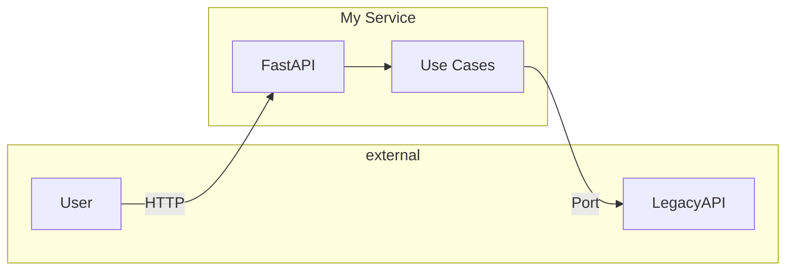
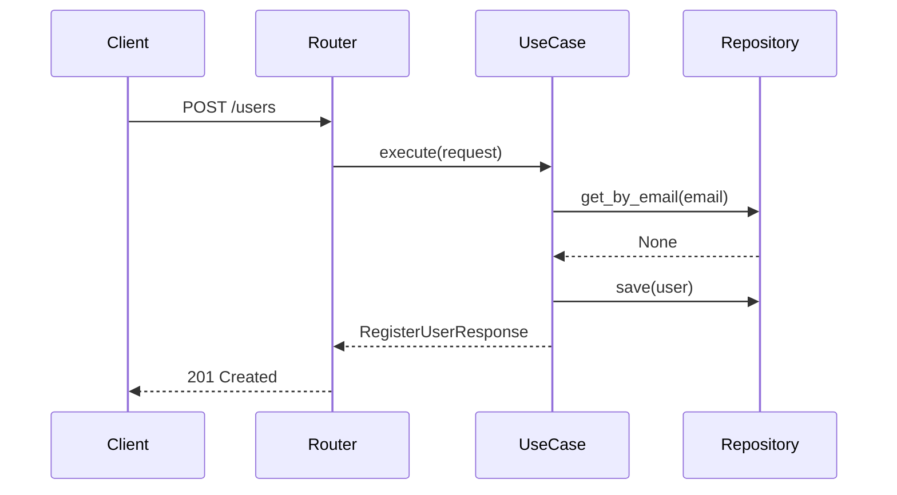
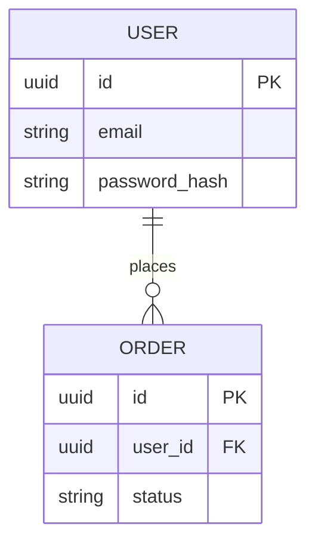
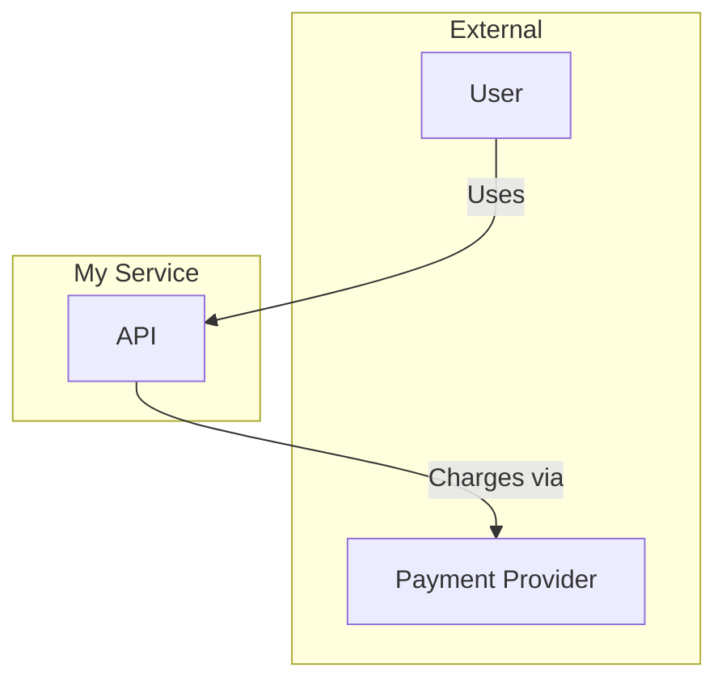
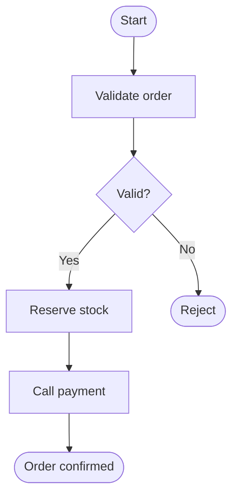

# Architect Skill — Reference (Mermaid, BPMN, Snippets)

## Mermaid — Quick Syntax

### Flowchart (architecture, flows)



Direction: `TD` (top-down), `LR` (left-right), `BT`, `RL`. Use `-->` for arrow, `---` for line, `-->|label|` for labeled edge.

### Sequence diagram



Use `->>` for sync, `-->>` for return; `activate`/`deactivate` for lifeline emphasis.

### Entity-relationship (tables)



Relations: `||--o{` one-to-many, `||--||` one-to-one, `}o--o{` many-to-many.

### C4-style context (system and actors)



Use one diagram for system context; optional second diagram for containers (main components inside the system).

---

## BPMN Concepts (for Mermaid or prose)

When drawing process flows (in Mermaid or a BPMN tool), use these elements consistently:

| Element | Meaning | When to use |
|--------|----------|-------------|
| **Start event** | Process start | One per process (e.g. "Order received") |
| **End event** | Process end | Success, failure, or cancel |
| **Task** | Unit of work | "Validate order", "Call payment API" |
| **Exclusive gateway** | One path only (XOR) | Decisions: "Payment OK?" → Yes/No |
| **Parallel gateway** | All paths (AND) | Fork/join for concurrent steps |
| **Sequence flow** | Order | Arrows between elements |
| **Pool / Lane** | Actor or system | Who performs the task (e.g. "Customer", "Backend") |

### Simple BPMN-style flowchart in Mermaid



Use `([ ])` for events, `[ ]` for tasks, `{ }` for gateways when approximating BPMN in Mermaid.

---

## Docker Snippets

### Minimal multi-stage Dockerfile (FastAPI + uvicorn)

```dockerfile
FROM python:3.12-slim as builder
WORKDIR /app
RUN pip install --no-cache-dir --upgrade pip
COPY requirements.txt .
RUN pip install --no-cache-dir -r requirements.txt

FROM python:3.12-slim
WORKDIR /app
RUN useradd --create-home appuser
COPY --from=builder /usr/local/lib/python3.12/site-packages /usr/local/lib/python3.12/site-packages
COPY --from=builder /usr/local/bin /usr/local/bin
COPY . .
USER appuser
EXPOSE 8000
CMD ["uvicorn", "main:app", "--host", "0.0.0.0", "--port", "8000"]
```

### Compose (app + Postgres)

```yaml
services:
  api:
    build: .
    ports: ["8000:8000"]
    environment:
      DATABASE_URL: postgresql+asyncpg://postgres:secret@db:5432/appdb
    depends_on:
      db: { condition: service_healthy }
  db:
    image: postgres:16-alpine
    environment:
      POSTGRES_USER: postgres
      POSTGRES_PASSWORD: secret
      POSTGRES_DB: appdb
    volumes: ["pgdata:/var/lib/postgresql/data"]
    healthcheck:
      test: ["CMD-SHELL", "pg_isready -U postgres"]
      interval: 5s
      timeout: 5s
      retries: 5
volumes:
  pgdata:
```

---

## Naming and Terminology

- **Port**: Interface (e.g. `UserRepository`, `PasswordHasher`); defined in or beside domain.
- **Adapter**: Implementation of a port (e.g. `SQLAlchemyUserRepository`, `BcryptPasswordHasher`).
- **Use case**: Application service that uses domain and ports; no HTTP or SQL.
- **Router**: FastAPI route module; HTTP adapter that calls use cases.

Use these terms consistently in ADRs and Mermaid diagrams so the agent and readers stay aligned with the hexagonal layout.
