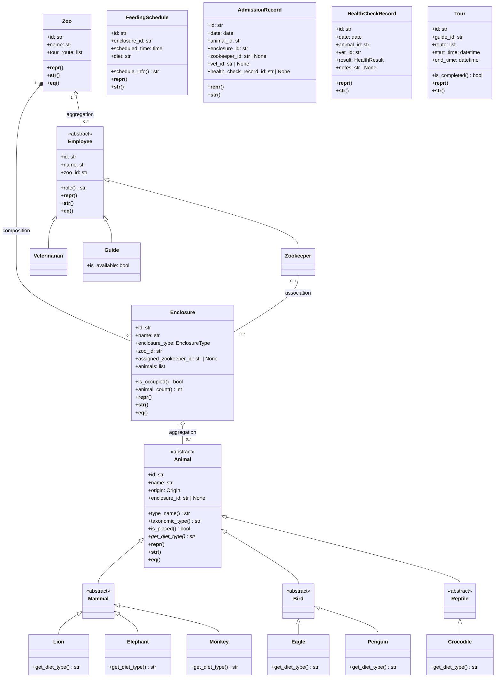

# Zoo Management System

A REST API for zoo operations: animal admission, zookeeper assignment, feeding rounds, health checks, and guided tours. Built with Python 3.12, FastAPI, and a hexagonal (ports & adapters) architecture.

---

## 1. Project Overview

The **Zoo Management System** exposes an HTTP API used by four roles: Zoo Manager, Zookeeper, Veterinarian, and Guide. It supports admitting animals to enclosures, assigning zookeepers to enclosures, executing feeding rounds, recording health checks, and conducting guided tours. State is held in-memory (no database for MVP); the design allows swapping to PostgreSQL via adapters without changing domain or use-case code.

### How to run

```bash
pip install -r requirements.txt && uvicorn main:app
```

The API is served at `http://localhost:8000` (or the host/port configured in `AppConfig`). OpenAPI docs: `http://localhost:8000/docs`.

### How to test

```bash
pip install -r requirements-dev.txt && pytest
```

Run subsets: `pytest tests/unit/`, `pytest tests/integration/`, `pytest tests/step_defs/`.

---

## 2. User Stories

1. As a **zoo manager**, I want to admit a new animal to a suitable enclosure  
   so that it is correctly housed and has an assigned caretaker.

2. As a **zookeeper**, I want to execute a feeding round for my assigned enclosure  
   so that animals are fed on time.

3. As a **veterinarian**, I want to conduct a health check on an animal and record the result  
   so that the zoo can track health and schedule follow-up.

4. As a **zoo manager**, I want to assign a zookeeper to an enclosure  
   so that feeding and daily care are clearly owned.

5. As a **guide**, I want to conduct a guided tour through the zoo's enclosures  
   so that visitors see all animals.

---

## 3. Class Diagram (Mermaid)

Domain model: Animal hierarchy (ABC → Mammal/Bird/Reptile → concrete), Employee hierarchy (ABC → Zookeeper/Veterinarian/Guide), Zoo, Enclosure, FeedingSchedule, and record types. Relationships: composition (Zoo–Enclosure), aggregation (Enclosure–Animal, Zoo–Employee), association (Zookeeper–Enclosure).



---

## 4. API Endpoints

| Method | Path | Success |
|--------|------|---------|
| GET | `/animals/{animal_id}` | 200 |
| GET | `/enclosures/{enclosure_id}` | 200 |
| POST | `/enclosures/{enclosure_id}/zookeeper` | 200 |
| POST | `/animals/{animal_id}/admit` | 201 |
| POST | `/enclosures/{enclosure_id}/feeding-rounds` | 200 |
| POST | `/animals/{animal_id}/health-checks` | 201 |
| POST | `/tours` | 201 |

All POST endpoints expect JSON bodies; validation errors and domain rule violations return 422 with `{"detail": "<message>"}`. Not-found entities return 404.

---

## 5. Architecture

The application follows **hexagonal (ports & adapters)** and **Clean Architecture**:

- **Domain** (`zoo_management/domain/`): Entities (Animal/Employee hierarchies, Zoo, Enclosure, records), enums, exceptions, and **repository port** interfaces (ABCs). No FastAPI, Pydantic, or SQLAlchemy.

- **Use cases** (`zoo_management/usecases/`): Application logic (admit animal, assign zookeeper, execute feeding round, conduct health check, conduct guided tour). They depend only on domain and ports; no HTTP or framework imports.

- **Adapters**: **In-memory** (`adapters/in_memory.py`) implements all repository ports with dict-based storage. **Web** (`adapters/web/`) provides FastAPI routers (thin: validate → call use case → map response) and exception handlers (domain exceptions → HTTP status).

- **Infrastructure** (`zoo_management/infrastructure/`): Config, logging, dependency injection (FastAPI `Depends`), and seed data. `main.py` wires the app, seeds the repository once at startup, and serves requests.

Dependencies point inward: adapters and infrastructure depend on domain and use cases; domain and use cases stay free of framework and I/O details. Replacing the in-memory store with a SQL adapter requires only implementing the same ports in a new adapter module.
