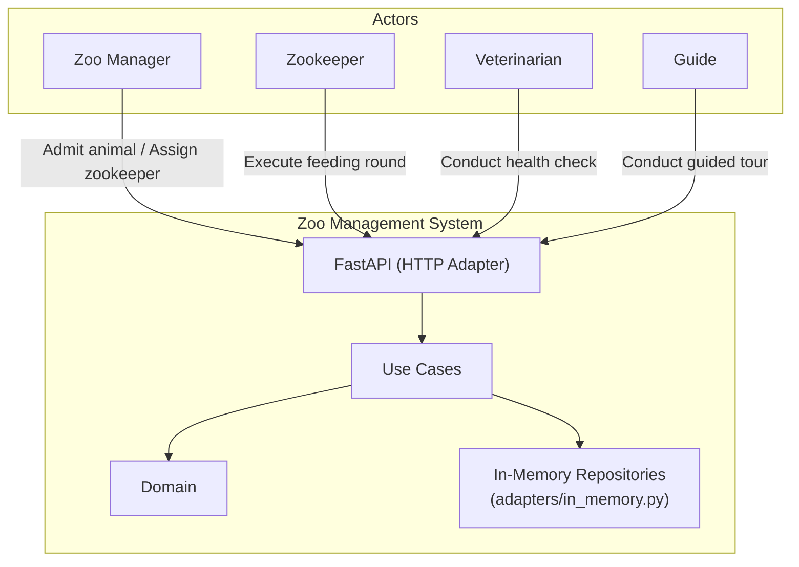
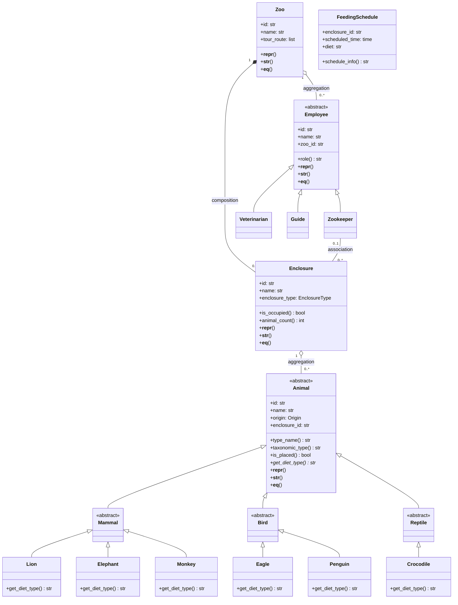

# Product Requirements Document (PRD)
## Zoo Management System — Core Operations

**Version:** 1.6  
**Status:** Draft (fourth engineer review addressed; ready for implementation)  
**Last updated:** 2026-03-10  
**Sources:** BPMN diagrams (`bpmn/`), business process definitions (`docs/business-processes-detailed.md`), BDD scenarios (`docs/bdd-scenarios.md`), feature files (`features/*.feature`), init context (`init-prompt.md`, `docs/init-requriements.md`).

---

## 1. Product vision and goals

### 1.1 Vision
A system that supports core zoo operations so that animals are correctly housed, cared for (feeding, health), and presented to visitors via guided tours, with clear assignment of staff (zookeepers, veterinarians, guides) to enclosures and processes.

### 1.2 Goals
- **Operational clarity:** Each process (admission, feeding, health check, zookeeper assignment, guided tour) has a defined flow, actors, and outcomes.
- **Traceability:** Requirements are expressed as business processes (BPMN), detailed process definitions, and executable BDD scenarios.
- **Technical alignment:** The system implements the suggested domain model (Animal hierarchy, Enclosure, Zoo, Employee hierarchy, FeedingSchedule) and satisfies stated technical requirements (OOP, tests, BDD).

### 1.3 Success criteria (high level)
- All five core processes are implemented and testable via BDD scenarios.
- Business rules (e.g. health check required for external arrivals, one zookeeper per enclosure, feeding only by assigned zookeeper) are enforced and covered by scenarios.
- Documentation and diagrams stay consistent (BPMN ↔ process docs ↔ features).

---

## 2. Stakeholders and users

| Role | Description | Primary use |
|------|--------------|-------------|
| **Zoo manager** | Oversees operations; admits animals, assigns zookeepers to enclosures. | Animal admission, Assign zookeeper to enclosure. |
| **Zookeeper** | Assigned to one or more enclosures; executes feeding and daily care. | Execute feeding round. |
| **Veterinarian** | Performs health checks; result drives admission (cleared/not cleared) and follow-up. | Conduct health check; part of animal admission when health check required. |
| **Guide** | Leads guided tours along a defined route of enclosures. | Conduct guided tour. |

*Note: "Reception" or "curator" may initiate admission in some flows; the project treats zoo manager as the primary actor for admission and assignment.*

---

## 3. Scope

### 3.1 In scope
- **Animal admission to enclosure:** Register animal → optional health check → place in suitable enclosure → assign zookeeper if needed → confirm.
- **Execute feeding round:** Zookeeper requests feeding round for a specific enclosure → retrieve feeding schedule → check current time = scheduled time → check zookeeper assigned to enclosure → check animals present → feed and record.
- **Conduct health check:** Request → veterinarian retrieves animal → examine → record result (Healthy / Need follow-up / Critical) → optional follow-up or escalation.
- **Assign zookeeper to enclosure:** Identify enclosure and zookeeper → validate both belong to zoo → create/update association → confirm (reassignment replaces previous).
- **Conduct guided tour:** Schedule/request → check guide available → assign guide → get route → start → visit enclosures in order → end tour.

Supporting domain: Zoo, Enclosure, Animal (with species/type), Employee (Zookeeper, Veterinarian, Guide), FeedingSchedule, and their relationships as defined in init/requirements.

### 3.2 Out of scope (explicit)
- Visitor admission, ticketing, or bookings.
- Inventory (food, supplies) or procurement.
- HR onboarding, payroll, or employee master data beyond “employed by zoo”.
- Enclosure construction or capacity planning as separate processes.
- Quarantine or treatment as separate sub-processes (only end states “not admitted / quarantine” and “follow-up scheduled” / “escalated” are in scope).
- Multi-zoo or group-level reporting (single zoo assumed).

*If any of these are required later, the PRD and scope should be updated.*

---

## 4. Features and process traceability

| # | Feature / process | BPMN diagram | BDD feature file | Main actor |
|---|-------------------|--------------|------------------|------------|
| 1 | Animal admission to enclosure | `01_animal_admission.bpmn` | `animal_admission.feature` | Zoo manager (+ Vet when health check required) |
| 2 | Execute feeding round | `02_execute_feeding_round.bpmn` | `feeding_round.feature` | Zookeeper |
| 3 | Conduct health check | `03_conduct_health_check.bpmn` | `health_check.feature` | Veterinarian |
| 4 | Assign zookeeper to enclosure | `04_assign_zookeeper.bpmn` | `assign_zookeeper.feature` | Zoo manager |
| 5 | Conduct guided tour | `05_conduct_guided_tour.bpmn` | `guided_tour.feature` | Guide |

Process definitions and step-by-step flows: `docs/business-processes-detailed.md`.  
Scenario list and mapping: `docs/bdd-scenarios.md`.

---

## 5. Business rules (consolidated)

- **Enclosure suitability:** An animal is placed only in an enclosure suitable for its species/type. **Resolved:** Suitability = enclosure’s type matches the animal’s taxonomic type (Mammal, Bird, Reptile). Enclosure has a `suitable_for` / type (e.g. mammal, bird, reptile); animal type is given by its class (Mammal/Bird/Reptile). No capacity or species-level refinement required for MVP.
- **Health check for admission:** **Resolved:** A health check is **required** when the animal’s **origin is "external"** (delivery, transfer from outside). When **origin is "internal"** (e.g. in-zoo birth), no health check is required. Animal or admission request must carry an `origin` (external | internal). If required and not cleared by a veterinarian → not admitted / quarantine or follow-up.
- **One zookeeper per enclosure; one zookeeper, multiple enclosures:** At most one zookeeper is assigned to a given enclosure; reassignment replaces the previous assignment. A single zookeeper **may** be assigned to multiple enclosures (association is one-to-many from zookeeper side).
- **Feeding round:** Only a zookeeper **assigned to that enclosure** may execute the feeding round for it. **Resolved:** Feeding is “due” when the current time **exactly matches** the scheduled time in FeedingSchedule (no tolerance window for MVP). “Not due” → no feeding executed.
- **Zookeeper/Enclosure assignment:** Enclosure and zookeeper must both belong to the same zoo; otherwise assignment fails.
- **Guided tour:** A guide must be available to start the tour. **Resolved:** The zoo has **one default tour route** (ordered list of enclosures). Tour is complete when all enclosures in the route are visited in order.
- **Admission initiator:** **Resolved:** Only the **zoo manager** initiates admission in the system (aligns with feature “As a zoo manager”).

---

## 6. Assumptions and constraints

### 6.1 Assumptions
- Single zoo; no multi-site or group structure.
- At least one enclosure exists and is suitable for the animal type when admission is attempted (or admission fails with “no suitable enclosure”).
- Veterinarian and zookeeper are available when required by the process (no resource scheduling model).
- “Guide available” is a binary check at tour start; no detailed roster or conflict checking.
- Feeding schedule exists per enclosure (or per relevant unit); “feeding not due” is a valid outcome when time doesn’t match.
- Animal can be “registered but not in enclosure” (state before admission).

### 6.2 Constraints
- Project size is limited so that it remains manageable for evaluation (init-prompt).
- Technical stack and style: OOP (including ABC, inheritance, polymorphism, encapsulation), pytest and BDD, BPMN for process flows, Clean Architecture / hexagonal where applicable (see architect and FastAPI skills).

---

## 7. Non-functional requirements

### 7.1 Documentation
- Docstrings on all public classes and methods (domain, use cases, adapters).
- README with class diagram (UML or Mermaid) and a few User Stories.
- BPMN diagrams, process docs, and feature files must stay consistent.

### 7.2 Testing
- **Unit tests (use case layer):** In-memory fakes implementing domain interfaces (e.g. `InMemoryEnclosureRepository`). No DB, no HTTP. At least 10 unit tests across all five use cases.
- **Integration tests (HTTP layer):** FastAPI app with real routers and exception handlers; override use-case dependencies to inject the same fakes. Use `httpx.AsyncClient` + `ASGITransport`. Assert HTTP status codes and JSON body.
- **BDD scenarios:** Gherkin feature files in `features/`; executable via pytest-bdd or behave. One feature file per process; cover happy path and main exception paths.

### 7.3 Architecture
- **Sync throughout:** No async/await required — in-memory repositories have no I/O. Route handlers, use cases, and repositories are plain synchronous functions.
- **Layer isolation:** `domain/` and `usecases/` have zero imports from FastAPI or Pydantic.

### 7.4 API and error handling
- **Thin routers:** Routers validate HTTP input (Pydantic), build use-case request DTOs, call use case, map to API response. No business logic in routers.
- **Global exception handlers:** All domain exceptions are mapped to HTTP status codes in `adapters/web/exception_handlers.py`. Consistent JSON error shape: `{ "detail": "<message>" }` (see §8.8).
- **Validation at boundary:** Pydantic models with appropriate field constraints in router schemas.

### 7.5 Configuration and infrastructure
- **Config at startup:** Simple `config.py` with a dataclass or plain constants. No `DATABASE_URL` or external services required.
- **No migrations:** In-memory storage; no Alembic, no DDL.
- **No Docker:** Run directly with `uvicorn main:app`. No Docker Compose, no containers.

### 7.6 Logging
- Structured JSON logging configured once at startup via `infrastructure/logging.py`.
- Use cases log with `extra={}` for operational context (e.g. `animal_id`, `enclosure_id`, `zookeeper_id`).

*Performance, availability, security (auth/authz), and UX are out of scope for MVP. To be added in a future revision if required.*

---

## 8. Technical architecture

*Derived from the architect-python-fastapi and fastapi-clean-architecture skills. These decisions are binding for implementation.*

### 8.1 Stack

| Concern | Technology |
|---------|------------|
| **Language** | Python 3.12+, type hints, `abc.ABC` for ports — **no** `async/await` |
| **API framework** | FastAPI — HTTP adapter only; no business logic in routers |
| **Persistence** | **In-memory dict-based repositories** (production adapters); no DB, no SQLAlchemy |
| **Migrations** | None — in-memory state is initialised at startup |
| **Config** | Plain `config.py` dataclass; no Pydantic Settings, no `DATABASE_URL` |
| **Containers** | None — run with `uvicorn main:app` directly |
| **Architecture pattern** | Hexagonal / Clean Architecture (ports & adapters); swap to SQL adapter later by replacing `adapters/in_memory.py` only |
| **Testing** | pytest; httpx + ASGITransport for integration tests; pytest-bdd for BDD |

---

### 8.2 Project structure

```
zoo_management/
├── domain/                  # Pure Python — no framework imports
│   ├── entities.py          # Plain classes: Zoo, Enclosure, Animal subclasses, Employee subclasses,
│   │                        #   FeedingSchedule, AdmissionRecord, HealthCheckRecord, Tour
│   └── interfaces.py        # abc.ABC repository ports (one per aggregate root)
├── usecases/                # One module per process; depends only on domain
│   ├── assign_zookeeper.py
│   ├── admit_animal.py
│   ├── execute_feeding_round.py
│   ├── conduct_health_check.py
│   └── conduct_guided_tour.py
├── adapters/
│   ├── in_memory.py         # In-memory dict-based repository implementations (production adapters)
│   └── web/
│       ├── routers.py       # FastAPI routers (one per process group)
│       └── exception_handlers.py
├── infrastructure/
│   ├── config.py            # Simple config dataclass (no Pydantic Settings)
│   ├── dependencies.py      # FastAPI DI wiring (injects in-memory repos into use cases)
│   └── seed.py              # seed_data(repo) — called once in main.py at startup; stable IDs
├── tests/
│   ├── unit/                # Use case tests — inject in-memory repos directly (no HTTP)
│   ├── integration/         # HTTP tests with httpx + ASGITransport; dependency overrides
│   └── step_defs/           # pytest-bdd step definitions (one file per feature)
├── features/                # Gherkin BDD scenarios (*.feature files)
├── main.py
├── requirements.txt         # fastapi, uvicorn, httpx
├── requirements-dev.txt     # pytest, pytest-bdd, httpx, ruff, mypy
└── pyproject.toml           # ruff + mypy config
```

---

### 8.3 Layer rules

| Layer | Allowed imports | Forbidden |
|-------|----------------|-----------|
| **domain/** | `dataclasses`, `abc`, `uuid`, `enum`, `logging` | FastAPI, SQLAlchemy, Pydantic |
| **usecases/** | domain entities and interfaces, logging | HTTP, DB, framework imports |
| **adapters/** | domain interfaces, FastAPI, Pydantic | Business logic, SQLAlchemy |
| **infrastructure/** | Wiring, config | Business logic |

Key rules:
- **Routers**: validate input (Pydantic), build use-case DTO, call use case, map response. No business logic; no direct repository calls.
- **Repositories**: sync in-memory; no transaction concept. A future async SQL adapter would commit at the session dependency boundary.
- **Use cases**: receive request DTO and injected ports; raise domain exceptions (e.g. `NoSuitableEnclosureError`, `ZookeeperNotAssignedError`) that the web layer maps to HTTP status codes.

---

### 8.4 Domain model — full class hierarchy

#### Animal hierarchy (ABC)

```
Animal (ABC)                           ← abstract base, no direct instantiation
├── Mammal (ABC)                       ← abstract middle tier
│   ├── Lion                           ← concrete
│   ├── Elephant                       ← concrete
│   └── Monkey                         ← concrete
├── Bird (ABC)                         ← abstract middle tier
│   ├── Eagle                          ← concrete
│   └── Penguin                        ← concrete
└── Reptile (ABC)                      ← abstract middle tier
    └── Crocodile                      ← concrete
```

#### Employee hierarchy (ABC)

```
Employee (ABC)
├── Zookeeper
├── Veterinarian
└── Guide
```

#### Other domain classes

```
Zoo, Enclosure, FeedingSchedule
AdmissionRecord, HealthCheckRecord, Tour   ← audit / record entities
```

**Total defined classes: 18** (10 animal/employee + Zoo + Enclosure + FeedingSchedule + AdmissionRecord + HealthCheckRecord + Tour). Satisfies graded minimum of 8.

---

#### Entity fields, `@property`, and special methods

*`@property` is used for computed/derived attributes; stored fields are set in `__init__`. `__repr__`/`__str__`/`__eq__` are implemented explicitly in every class (no `@dataclass` — see §10 Q3 decision).*

| Class | Key `__init__` fields | `@property` (computed) | Abstract / override methods | `__repr__` / `__str__` / `__eq__` |
|-------|------------------------|------------------------|-----------------------------|-----------------------------------|
| `Animal` (ABC) | `id`, `name`, `origin: Origin`, `enclosure_id: str\|None` | `type_name: str` (→ concrete class name, e.g. `"Lion"`), `taxonomic_type: str` (→ mid-tier ABC name, e.g. `"Mammal"`; see ADR-020 + ADR-025 docstring warning), `is_placed: bool` | `get_diet_type()* → str` *(abstract — called as `animal.get_diet_type()`)* | all three; `__eq__` by `id` |
| `Mammal` (ABC) | *(inherits)* | *(inherits)* | `get_diet_type()* → str` *(abstract)* | inherits |
| `Bird` (ABC) | *(inherits)* | *(inherits)* | `get_diet_type()* → str` *(abstract)* | inherits |
| `Reptile` (ABC) | *(inherits)* | *(inherits)* | `get_diet_type()* → str` *(abstract)* | inherits |
| `Lion` | *(inherits)* | *(inherits)* | `get_diet_type()` → `"carnivore"` | inherits `__repr__`/`__str__`, `__eq__` |
| `Elephant` | *(inherits)* | *(inherits)* | `get_diet_type()` → `"herbivore"` | inherits |
| `Monkey` | *(inherits)* | *(inherits)* | `get_diet_type()` → `"omnivore"` | inherits |
| `Eagle` | *(inherits)* | *(inherits)* | `get_diet_type()` → `"carnivore"` | inherits |
| `Penguin` | *(inherits)* | *(inherits)* | `get_diet_type()` → `"piscivore"` | inherits |
| `Crocodile` | *(inherits)* | *(inherits)* | `get_diet_type()` → `"carnivore"` | inherits |
| `Employee` (ABC) | `id`, `name`, `zoo_id` | `role: str` (→ class name) | all three; `__eq__` by `id` |
| `Zookeeper` | *(inherits)* | *(inherits `role`)* | inherits |
| `Veterinarian` | *(inherits)* | *(inherits `role`)* | inherits |
| `Guide` | *(inherits)* | *(inherits `role`)* | inherits |
| `Zoo` | `id`, `name`, `tour_route: list[str]` | *(none — ADR-006: employee_count and enclosure_count removed; Zoo stores no collections)* | all three; `__eq__` by `id` |
| `Enclosure` | `id`, `name`, `enclosure_type: EnclosureType`, `zoo_id`, `assigned_zookeeper_id: str\|None` | `is_occupied: bool` (animals list non-empty), `animal_count: int` | all three; `__eq__` by `id` |
| `FeedingSchedule` | `id`, `enclosure_id`, `scheduled_time: time`, `diet: str` | `schedule_info: str` (formatted summary) | `__repr__` / `__str__` |
| `AdmissionRecord` | `id`, `date`, `animal_id`, `enclosure_id`, `zookeeper_id`, `vet_id: str\|None`, `health_check_record_id: str\|None` | — | `__repr__` / `__str__` |
| `HealthCheckRecord` | `id`, `date`, `animal_id`, `vet_id`, `result: HealthResult`, `notes: str\|None` | — | `__repr__` / `__str__` |
| `Tour` | `id`, `guide_id`, `route: list[str]`, `start_time`, `end_time: datetime\|None` | `is_completed: bool` | `__repr__` / `__str__` |

**Polymorphism:** `get_diet_type() -> str` is a **regular abstract method** (not a `@property`) — declared with `@abc.abstractmethod` on `Animal` and overridden in every concrete leaf class. It is called as `animal.get_diet_type()` (with parentheses) in both the feeding round and health check use cases. This is the primary polymorphic dispatch point through the full Animal hierarchy.

---

#### Repository ports (ABC interfaces in `domain/interfaces.py`)

> **Note — superseded by `architecture.md` C4.2:** The table below reflects the state as of PRD v1.5. Two methods were removed in the architecture review; the authoritative port contracts are in `architecture.md` C4.2:
> - `ZooRepository.save` — **removed**. No use case mutates a Zoo. A non-port `seed_zoo()` method on `InMemoryRepositories` handles the seed case (ADR-025).
> - `AnimalRepository.get_unplaced` — **removed**. No use case scans for unplaced animals.

```
ZooRepository              get_by_id
EnclosureRepository        get_by_id, get_by_zoo, save
AnimalRepository           get_by_id, save
EmployeeRepository         get_by_id, get_by_zoo_and_type, save
FeedingScheduleRepository  get_by_enclosure_and_time, save
AdmissionRecordRepository  save
HealthCheckRecordRepository  save
TourRepository             save
```

---

### 8.5 System context diagram



---

### 8.6 Entity-relationship diagram (MVP)

```mermaid
erDiagram
  ZOO ||--o{ ENCLOSURE : "owns (composition)"
  ZOO ||--o{ EMPLOYEE : "employs (aggregation)"
  ENCLOSURE ||--o{ ANIMAL : "holds (aggregation)"
  ENCLOSURE }o--|| EMPLOYEE : "assigned zookeeper (association, optional)"
  ENCLOSURE ||--o{ FEEDING_SCHEDULE : "has"
  ANIMAL ||--o{ ADMISSION_RECORD : "recorded in"
  ANIMAL ||--o{ HEALTH_CHECK_RECORD : "checked in"
  EMPLOYEE ||--o{ TOUR : "leads (guide)"

  ZOO { string id PK; string name; json tour_route }
  ENCLOSURE { string id PK; string name; string type; string zoo_id FK; string zookeeper_id FK }
  ANIMAL { string id PK; string name; string species; string animal_type; string origin; string enclosure_id FK }
  EMPLOYEE { string id PK; string name; string role; string zoo_id FK }
  FEEDING_SCHEDULE { string id PK; string enclosure_id FK; time scheduled_time; string diet }
  ADMISSION_RECORD { string id PK; date date; string animal_id FK; string enclosure_id FK; string zookeeper_id FK; string vet_id FK }
  HEALTH_CHECK_RECORD { string id PK; date date; string animal_id FK; string vet_id FK; string result; string notes }
  TOUR { string id PK; string guide_id FK; json route; datetime start_time; datetime end_time }
```

---

### 8.7 UML class diagram (for README)

*This is the diagram required in the README by the graded init requirements. It shows OOP hierarchy (inheritance, ABC) and relationships (composition, aggregation, association).*



---

### 8.8 Process → use case → API endpoint mapping

| # | Process | Use case class | HTTP endpoint |
|---|---------|---------------|---------------|
| 1 | Assign zookeeper to enclosure | `AssignZookeeperUseCase` | `POST /enclosures/{enclosure_id}/zookeeper` |
| 2 | Animal admission to enclosure | `AdmitAnimalUseCase` | `POST /animals/{animal_id}/admit` |
| 3 | Execute feeding round | `ExecuteFeedingRoundUseCase` | `POST /enclosures/{enclosure_id}/feeding-rounds` |
| 4 | Conduct health check | `ConductHealthCheckUseCase` | `POST /animals/{animal_id}/health-checks` |
| 5 | Conduct guided tour | `ConductGuidedTourUseCase` | `POST /tours` |

Each endpoint: thin router → build use-case request DTO → call use case → map result to API response Pydantic model.

---

### 8.9 Domain exceptions → HTTP status codes

| Domain exception | HTTP status | Scenario |
|-----------------|-------------|---------|
| `NoSuitableEnclosureError` | 422 Unprocessable Entity | No enclosure type matches animal type |
| `HealthCheckNotClearedError` | 422 Unprocessable Entity | Animal not cleared by vet |
| `ZookeeperNotAssignedError` | 422 Unprocessable Entity | Feeding attempt by unassigned zookeeper |
| `FeedingNotDueError` | 422 Unprocessable Entity | Current time doesn't match scheduled time |
| `EnclosureNotInZooError` | 422 Unprocessable Entity | Enclosure or zookeeper not in zoo |
| `NoGuideAvailableError` | 422 Unprocessable Entity | No guide available for tour |
| `InvalidEmployeeRoleError` | 422 Unprocessable Entity | Employee found but is the wrong subtype (e.g. Guide passed as vet_id) |
| `InvalidRequestError` | 422 Unprocessable Entity | Required field absent for the operation (e.g. vet_id missing for external animal) |
| `AnimalAlreadyPlacedError` | 422 Unprocessable Entity | Attempt to admit an animal that already has an assigned enclosure (ADR-013) |
| `GuideNotInZooError` | 422 Unprocessable Entity | Guide does not belong to the requested zoo (ADR-026; cross-zoo consistency guard) |
| `EntityNotFoundError` | 404 Not Found | Animal, enclosure, employee, or schedule not found in store |
| Unhandled exception | 500 Internal Server Error | Unexpected error |

All errors return a consistent JSON shape: `{ "detail": "<message>" }`.

---

### 8.10 Key architectural decisions (ADR summary)

| Decision | Choice | Rationale |
|----------|--------|-----------|
| Architecture pattern | Hexagonal / Clean Architecture | Domain and use cases stay framework-agnostic; future DB adapter swap requires only replacing `adapters/in_memory.py` |
| Persistence | In-memory dict-based repositories as production adapters | Graded criteria do not include DB; removes Docker/SQL setup risk for grader; ports stay unchanged for future swap |
| Sync (no async) | Plain `def` everywhere | No I/O means async adds zero value and significant cognitive overhead; graders need not understand asyncio |
| Domain entities | Plain classes (no `@dataclass`) | `__repr__`, `__str__`, `__eq__`, and `@property` are visibly explicit — grader sees all required OOP methods |
| Animal subclass persistence | N/A for in-memory; future DB adapter should use flat table + `species` string | Python class reconstructed from `species` at load time; simpler than STI for a single-developer project |
| Config | Plain `config.py` dataclass | No external env vars or services needed; grader runs `uvicorn main:app` without any setup |
| Logging | Standard `logging` module; use-case level log statements | Sufficient for scope; no JSON aggregator needed for a course project |

---

## 9. Resolved decisions (business analysis — v1.1)

The following were open in v1.0; they have been resolved using business-analytics reasoning and project context (features, BPMN, domain skill). Outcomes are reflected in Section 5 (business rules) and in `docs/business-processes-detailed.md`.

### 8.1 Rules and criteria — resolved
- **Health check “required”:** Health check is required when the animal’s **origin is "external"** (delivery, transfer from outside); not required when **origin is "internal"** (e.g. in-zoo birth). Animal or admission request carries `origin: external | internal`. *Rationale:* Matches scenarios “without health check (in-zoo birth)” and “health check required for Simba”; keeps rule testable and simple.
- **Enclosure suitability:** Suitability = enclosure type matches animal’s taxonomic type (Mammal, Bird, Reptile). Enclosure has a type (e.g. mammal, bird, reptile); animal type from class hierarchy. No capacity or species-level refinement for MVP. *Rationale:* Aligns with init classes (Mammal/Bird/Reptile) and BA glossary (“species/type”).
- **Feeding “due”:** Feeding is due when current time **exactly matches** the scheduled time (no tolerance window for MVP). *Rationale:* Feature “current time is 09:00” vs “10:00” implies exact match; tolerance can be added later.
- **Empty enclosure and feeding:** Confirmed: if enclosure has no animals, feeding round still completes and is recorded with note “no animals to feed” (per BPMN and features).

### 8.2 Actors and initiation — resolved
- **Admission initiator:** **Zoo manager** is the only role that initiates admission in the system. *Rationale:* Feature states “As a zoo manager” and “the zoo admits”; keeps MVP simple; other roles can be added later.
- **BPMN lanes:** PRD and `business-processes-detailed.md` remain the source of truth for “who does what.” No BPMN lanes added for MVP to limit scope. *Rationale:* Process doc already assigns roles per step.

### 8.3 Edge cases and exceptions — resolved / deferred
- **Quarantine and follow-up:** **Deferred.** No separate process for “move from quarantine to enclosure” or “schedule follow-up.” Only end states (not admitted/quarantine, follow-up scheduled, escalated) are in scope. *Rationale:* BPMN and features only define these outcomes; no scenarios for quarantine flow.
- **Enclosure temporarily unavailable:** **Deferred** for MVP. Not in BPMN or scenarios. Can be added later (e.g. enclosure maintenance flag). *Rationale:* Keeps scope manageable.
- **Zookeeper ↔ enclosure cardinality:** **Resolved:** At most one zookeeper per enclosure; one zookeeper may be assigned to multiple enclosures. *Rationale:* BA skill: “Assigned to one or more enclosures” and “at most one zookeeper per enclosure.” Model supports one-to-many from zookeeper side; current scenarios remain one-to-one.

### 8.4 Data and audit — resolved
- **AdmissionRecord, HealthCheckRecord, Tour:** **Required for MVP** as minimal persisted records: (a) **AdmissionRecord:** date, animal, enclosure, zookeeper, vet (if health check performed). (b) **HealthCheckRecord:** date, animal, veterinarian, result (Healthy / Need follow-up / Critical). (c) **Tour:** guide, route, start time, end time. *Rationale:* Enables audit and traceability without a separate audit system.
- **Tour route ownership:** **One default tour route per zoo** (ordered list of enclosures). Per-tour override is out of scope for MVP. *Rationale:* BA glossary “tour route: ordered list of enclosures”; one route per zoo is simplest.

### 8.5 Prioritization and phasing — resolved
- **Order of delivery:** **Confirmed:** (1) Assign zookeeper to enclosure, (2) Animal admission, (3) Execute feeding round, (4) Conduct health check, (5) Conduct guided tour. *Rationale:* Admission depends on zookeeper assignment; feeding depends on enclosures and assignments; health check and tour are self-contained; tour needs enclosures and guide.

---

## 9. OOP graded requirements traceability

*The init-prompt specifies graded criteria. This section explicitly maps each to implementation artifacts so nothing is missed.*

| Graded requirement | Implemented by | Notes |
|--------------------|----------------|-------|
| **Min. 8 classes, full hierarchy** | `Animal`, `Mammal`, `Bird`, `Reptile`, `Lion`, `Elephant`, `Monkey`, `Eagle`, `Penguin`, `Crocodile`, `Employee`, `Zookeeper`, `Veterinarian`, `Guide`, `Zoo`, `Enclosure`, `FeedingSchedule` = **17 domain classes** | Exceeds minimum |
| **Abstraction (ABC)** | `Animal(ABC)`, `Mammal(ABC)`, `Bird(ABC)`, `Reptile(ABC)`, `Employee(ABC)`; repository ports in `domain/interfaces.py` (ABC) | Abstract classes cannot be instantiated directly |
| **Encapsulation** | `@dataclass` with `field(repr=False)` for sensitive/internal fields; `@property` for computed values that do not expose raw internals; methods on domain classes operate on own state | Properties: `is_placed`, `is_occupied`, `type_name`, `role`, `schedule_info`, `is_completed`, etc. |
| **Inheritance** | Animal: ABC → Mammal/Bird/Reptile → concrete (3 levels); Employee: ABC → Zookeeper/Veterinarian/Guide | Both hierarchies have at least 2 levels |
| **Polymorphism** | `get_diet_type() → str` abstract on `Animal`, overridden in 6 concrete classes; called polymorphically in health check + feeding use cases | One polymorphic method through the full hierarchy |
| **At least 3 relationship types** | Composition: `Zoo ◆── Enclosure`; Aggregation: `Enclosure ◇── Animal`, `Zoo ◇── Employee`; Association: `Zookeeper ── Enclosure` | 4 relationships; all 3 types present |
| **ABC and `@property`** | ABCs: `Animal`, `Employee`, all repository ports; `@property`: `type_name`, `role`, `is_placed`, `is_occupied`, `animal_count`, `schedule_info`, `is_completed` | ≥ 2 properties per hierarchy; `employee_count`/`enclosure_count` removed per ADR-006 |
| **`__repr__`, `__str__`, `__eq__`** | All core domain classes: `Animal` (and subclasses via inheritance), `Employee` subclasses, `Zoo`, `Enclosure`, `FeedingSchedule` | See §8.4 entity table |
| **Min. 10 unit / integration tests** | `tests/unit/`: one test module per use case (5 modules × ≥ 2 tests = 10+); `tests/integration/`: one test module per process (5 modules) | Fakes for unit; dependency overrides for integration |
| **BDD scenarios + executable BDD tests** | `features/*.feature` (5 files, 20 scenarios); `tests/step_defs/*.py` (one per feature); run via `pytest --bdd` (pytest-bdd) | Step definitions required to be executable, not just Gherkin |
| **Docstrings** | All public classes and methods in `domain/`, `usecases/`, `adapters/`, `infrastructure/` | Google or NumPy style |
| **Class diagram in README** | Mermaid `classDiagram` from §8.7 copied to README.md | Shows hierarchy, ABC, relationships |
| **User Stories in README** | 5 User Stories (one per process, Actor + action + benefit) in README.md | Derived from feature file headers ("As a…") |

### User Stories for README (draft)

| # | User Story |
|---|-----------|
| 1 | As a **zoo manager**, I want to admit a new animal to a suitable enclosure so that it is correctly housed and has an assigned caretaker. |
| 2 | As a **zookeeper**, I want to execute a feeding round for my assigned enclosure so that animals are fed on time. |
| 3 | As a **veterinarian**, I want to conduct a health check on an animal and record the result so that the zoo can track health and schedule follow-up. |
| 4 | As a **zoo manager**, I want to assign a zookeeper to an enclosure so that feeding and daily care are clearly owned. |
| 5 | As a **guide**, I want to conduct a guided tour through the zoo's enclosures in order so that visitors see all animals. |

---

## 10. Architect decisions (resolved — v1.4)

*All three questions from the senior engineer review are resolved below. These decisions are binding for implementation.*

---

### ✅ Q1 — Stack: FastAPI + in-memory repositories (no DB infrastructure)

**Decision:** Keep FastAPI as the thin HTTP adapter. Replace all DB infrastructure (PostgreSQL, SQLAlchemy, asyncpg, Alembic, Docker) with **in-memory dict-based repositories as the production adapter** (`adapters/in_memory.py`).

**Rationale:**
- The graded criteria (OOP, pytest, BDD, docstrings, README) do not require a database or containers. Keeping PostgreSQL + Docker + Alembic adds ~30 % more files and multiple potential failure points for the grader (Docker not installed, `DATABASE_URL` not set, migration not run).
- FastAPI itself is lightweight (`pip install fastapi uvicorn`) and demonstrates the HTTP/use-case separation without any infrastructure cost.
- Hexagonal architecture (ports & adapters) makes the adapter swap trivial later: `domain/interfaces.py` ports are unchanged; only `adapters/in_memory.py` is replaced with a SQL adapter when a DB is needed.
- Removing async: in-memory repos have no I/O, so `async/await` adds cognitive overhead for zero benefit. All layers use plain synchronous `def`.

**What is dropped vs. current PRD:**

| Dropped | Reason |
|---------|--------|
| PostgreSQL + SQLAlchemy + asyncpg | Replaced by in-memory dicts |
| Alembic migrations | No schema to migrate |
| Docker / Docker Compose | Not needed; grader runs `uvicorn main:app` |
| Pydantic Settings / `DATABASE_URL` | No external config required |
| `async/await` everywhere | No I/O; sync is simpler and clearer |
| `infrastructure/database.py`, `db_models.py` | No ORM layer |

**What is kept:**

| Kept | Reason |
|------|--------|
| FastAPI + thin routers | HTTP adapter; integration tests via httpx |
| All domain entities and use cases | Unchanged — core of grading |
| All repository port interfaces (`domain/interfaces.py`) | Adapter swap point |
| pytest + pytest-bdd | Directly graded |
| Docstrings, README, class diagram | Directly graded |

---

### ✅ Q2 — Animal subclasses in DB: not applicable (in-memory)

**Decision:** With in-memory storage, Python objects are stored and retrieved as-is. The concrete class (Lion, Elephant, etc.) is preserved at runtime — no serialisation strategy is needed. Q2 is **moot for the current implementation**.

**For future reference (if a DB adapter is added later):** Use **Option C — flat table + `species` string**. The Python class is reconstructed from the `species` column at load time (e.g. a factory dict `{"lion": Lion, "elephant": Elephant, ...}`). STI and class table inheritance add SQLAlchemy complexity disproportionate to a single-developer project.

---

### ✅ Q3 — Domain entities: plain class (no `@dataclass`)

**Decision:** Use **plain classes** (`class Animal: def __init__(self, ...)`). No `@dataclass` decorator.

**Rationale:**
- Graded criteria explicitly require `__repr__`, `__str__`, `__eq__`, and `@property`. With `@dataclass`, these are auto-generated or partially hidden — a grader scanning the code may not see them explicitly.
- Plain class makes every required OOP method visibly explicit at the implementation line, eliminating any ambiguity in scoring.
- `@property` works identically in plain classes; no functionality is lost.
- Trade-off accepted: more verbose `__init__` boilerplate, but the verbosity itself demonstrates the OOP skill being assessed.

---

## 12. Document references

| Document | Purpose |
|----------|---------|
| `init-prompt.md` | Project context, role (PM), technical direction, BPMN. |
| `docs/init-requriements.md` | Technical requirements (OOP, tests, BDD, classes, relations). |
| `docs/business-processes-detailed.md` | Full process definitions (triggers, steps, gateways, exceptions). |
| `docs/bdd-scenarios.md` | Gherkin scenario list and mapping to processes. |
| `bpmn/README.md` | Index of BPMN diagrams and how to open them. |
| `features/README.md` | Index of feature files and how to run BDD. |
| `features/*.feature` | Executable Gherkin scenarios per process. |
| `.cursor/skills/business-analytics-process-zoo/` | Domain glossary, discovery questions, process design guidance. |
| `.cursor/skills/product-manager-zoo/` | PM decisions, domain answers, no guessing. |
| `.cursor/skills/architect-python-fastapi/` | Stack, hexagonal architecture, BPMN, Mermaid diagrams, Docker patterns. |
| `.cursor/skills/fastapi-clean-architecture/` | Clean Architecture layers, async, Unit of Work, testing patterns, full code reference. |

---

## 13. Revision history

| Version | Date | Changes |
|---------|------|---------|
| 1.0 | 2025-03-10 | Initial PRD from BPMN, docs, and features; gaps section for business analyst. |
| 1.1 | 2025-03-10 | Business analysis: resolved all open questions; formalized rules (health check trigger, suitability, feeding due, initiator, records, route, zookeeper cardinality); deferred quarantine process and enclosure unavailable; updated business-processes-detailed.md. |
| 1.2 | 2025-03-10 | Architect review: added §8 Technical Architecture (stack, project structure, layer rules, domain entities, ER diagram, system context diagram, use case → endpoint mapping, exception → HTTP status mapping, ADR summary); expanded §7 NFRs (async, UoW, layer isolation, error handling, config, Docker, migrations, logging); updated §9 references with architect skills. |
| 1.3 | 2025-03-10 | Senior engineer review: added full concrete class hierarchy (Lion, Elephant, Monkey, Eagle, Penguin, Crocodile, Mammal, Bird, Reptile) to §8.4; specified @property per class; specified __repr__/__str__/__eq__ per class; added Mermaid classDiagram (§8.7); added BDD step_defs/ to project structure; added §9 OOP requirements traceability (graded criteria map, User Stories for README); added §10 Open questions for architect (FastAPI scope risk, DB strategy for animal subclasses, @dataclass vs plain class). |
| 1.4 | 2026-03-10 | Architect decisions: Q1 — keep FastAPI, drop PostgreSQL/SQLAlchemy/Alembic/Docker/async; in-memory dict repositories as production adapters; updated §8.1 stack, §8.2 project structure, §7.3/7.5 NFRs, §8.5 context diagram, §8.10 ADR; Q2 — moot (in-memory); flat+species for future DB adapter; Q3 — plain class over @dataclass for grading visibility; resolved §10 open questions. |
| 1.5 | 2026-03-10 | Engineer review response (15 findings): §8.3 — removed SQLAlchemy from adapters, removed stale AsyncSession bullet; §8.4 Zoo — removed employee_count/enclosure_count (ADR-006); §8.4 table — split @property column, added abstract methods column, clarified get_diet_type() is a regular method; §8.7 UML — aligned Zoo with ADR-006; §8.8 — removed "async"; §8.2 — added infrastructure/seed.py. Full decisions in architecture.md v1.2. |
| 1.6 | 2026-03-10 | Fourth engineer review response: INC-1 — §8.4 repository ports table updated; `ZooRepository.save` and `AnimalRepository.get_unplaced` marked removed with superseded note referencing architecture.md C4.2. INC-2 — `taxonomic_type: str` added to Animal @property column (§8.4) and Animal class in §8.7 UML. INC-3 — `AnimalAlreadyPlacedError → 422` added to §8.9. DQ-B — `GuideNotInZooError → 422` added to §8.9. DQ-C — `health_check_record_id: str\|None` added to `AdmissionRecord` in §8.4 entity table. Full decisions: ADR-025 through ADR-028 in architecture.md v1.5. |
