# Zoo Management System — Solution Architecture (C4 Model)

**Version:** 1.6 | **Date:** 2026-03-10
**Source:** `docs/PRD.md` v1.6 · `docs/adr.md` (ADR-001 through ADR-031)
**Revision:** Fifth engineer review response — BLK-1 (`adr.md` missing ADR-025–028 resolved), INC-1 (nullable fields in C4.1), INC-2 (`note?` → `note`), INC-3 (header ADR range), INC-4 (`HealthCheckRecord.notes` nullability), INC-5 (Process 3 non-existent enclosure ordering); DQ-2 (`end_time` added to `GuidedTourResponse`), DQ-3 (idempotent re-assignment); ADR-029–031 added
**Skills applied:** `architect-python-fastapi` · `fastapi-clean-architecture`

---

## Table of Contents

1. [C1 — System Context](#c1--system-context)
2. [C2 — Container](#c2--container)
3. [C3 — Component](#c3--component)
4. [C4 — Code](#c4--code)
   - [C4.1 Domain Class Hierarchy](#c41--domain-class-hierarchy)
   - [C4.2 Repository Port Contracts](#c42--repository-port-contracts)
   - [C4.3 Use Case Classes and DTOs](#c43--use-case-classes-and-dtos)
   - [C4.4 Process Sequence Diagrams](#c44--process-sequence-diagrams)
   - [C4.5 Testing Architecture](#c45--testing-architecture)
   - [C4.6 Entity-Relationship Diagram](#c46--entity-relationship-diagram)
5. [ADR Summary](#adr-summary)

---

## C1 — System Context

> **What is the system and who uses it?**
> The Zoo Management System supports five core zoo operations. Four human roles interact with it over HTTP. There are no external systems for this MVP — no auth provider, no database server, no message broker.

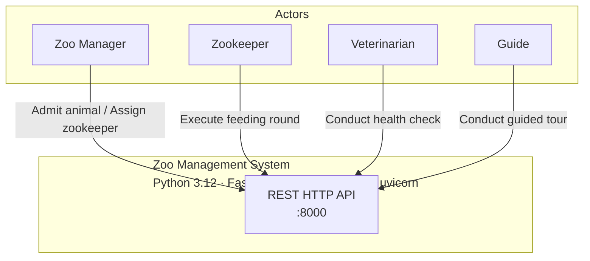

**Actors (from PRD §2):**

| Actor | Primary interactions |
|-------|---------------------|
| Zoo Manager | Initiates animal admission; assigns zookeepers to enclosures |
| Zookeeper | Executes feeding rounds for their assigned enclosures |
| Veterinarian | Conducts health checks; records Healthy / Need follow-up / Critical result |
| Guide | Leads guided tours through the zoo's single default enclosure route |

**Out of scope for MVP:** visitor ticketing, inventory management, HR/payroll, multi-zoo, authentication/authorisation.

---

## C2 — Container

> **What are the deployable/runnable units?**
> This MVP runs as a single process. In-memory dict-based state lives inside the same process — there is no separate database container. The hexagonal port design (`domain/interfaces.py`) allows replacing the in-memory adapter with a PostgreSQL adapter without touching domain or use-case code.

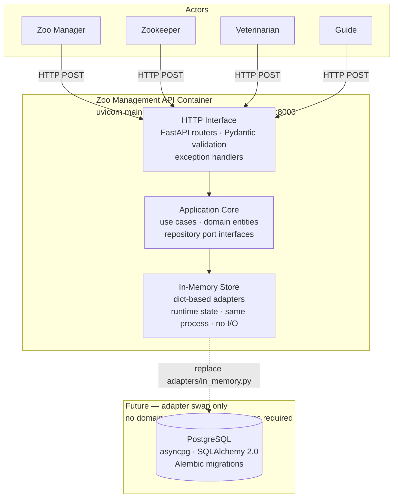

**Key architectural decision (PRD §10 ADR Q1):** PostgreSQL, SQLAlchemy, asyncpg, Alembic, and Docker were dropped for MVP. In-memory dict repositories are the production adapter. The port boundary in `domain/interfaces.py` is unchanged; only `adapters/in_memory.py` is swapped when a DB is needed.

---

## C3 — Component

> **What are the significant structural components inside the container?**
> The system is organised in four layers following Clean Architecture / hexagonal ports-and-adapters. The dependency rule is strict: adapters depend on ports; ports live inside domain; domain and use cases have zero FastAPI or Pydantic imports.

### Hexagonal component map

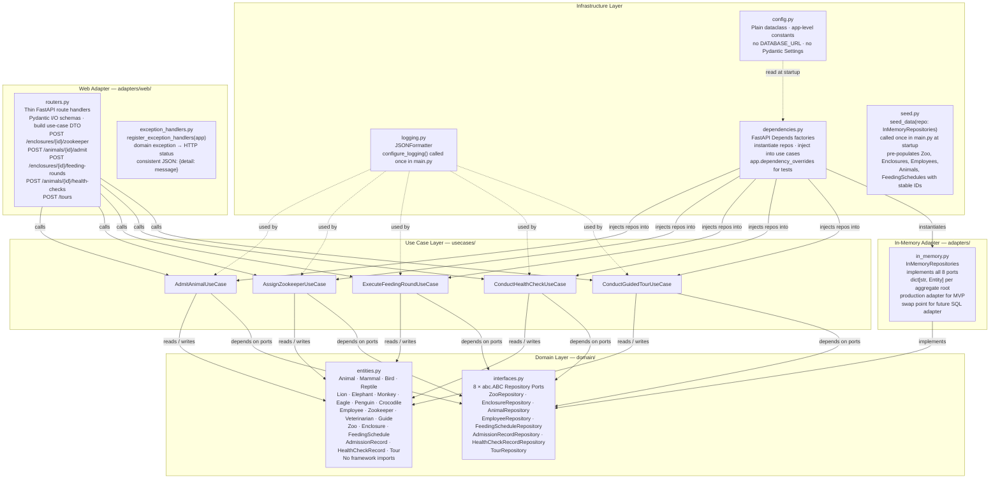

### Layer rules

Derived from `fastapi-clean-architecture` skill — enforced at import level by `ruff` and `mypy`:

| Layer | Allowed imports | Forbidden |
|-------|----------------|-----------|
| `domain/` | `abc`, `uuid`, `enum`, `logging`, `dataclasses` | FastAPI, Pydantic, SQLAlchemy |
| `usecases/` | domain entities + interfaces, `logging` | HTTP, DB, any framework import |
| `adapters/` | domain interfaces, FastAPI, Pydantic | Business logic |
| `infrastructure/` | wiring, config, logging | Business logic |

**Routers** — validate HTTP input (Pydantic schemas), build use-case request DTO, call `use_case.execute(request)`, map result to API response schema. No `if/else` business logic. No direct repository calls.

**Repositories** — accept and mutate domain entities only. Never call `commit()` (sync in-memory has no transaction; a future async SQL adapter commits at the session dependency boundary).

**Use cases** — receive a frozen request DTO and injected port instances. Raise typed domain exceptions (e.g. `NoSuitableEnclosureError`). Log operational context with `extra={"animal_id": ..., "enclosure_id": ...}`.

### Seed data (bootstrap)

`main.py` calls `seed_data(repo)` from `infrastructure/seed.py` once at startup, before the ASGI app begins serving requests. This pre-populates `InMemoryRepositories` with a stable, minimal dataset so that a grader can call every endpoint immediately after `uvicorn main:app` with no additional setup.

**Pre-seeded entities and stable IDs:**

| Type | ID | Key attributes |
|------|----|----------------|
| `Zoo` | `zoo-1` | name="City Zoo", tour_route=["enc-mammal-1","enc-bird-1","enc-reptile-1"] |
| `Enclosure` | `enc-mammal-1` | type=MAMMAL, zoo_id="zoo-1", zookeeper=emp-zk-1 |
| `Enclosure` | `enc-bird-1` | type=BIRD, zoo_id="zoo-1", zookeeper=emp-zk-1 |
| `Enclosure` | `enc-reptile-1` | type=REPTILE, zoo_id="zoo-1", zookeeper=emp-zk-1 |
| `Zookeeper` | `emp-zk-1` | name="Alice", zoo_id="zoo-1" |
| `Veterinarian` | `emp-vet-1` | name="Dr. Bob", zoo_id="zoo-1" |
| `Guide` | `emp-guide-1` | name="Carol", zoo_id="zoo-1", is_available=True |
| `Guide` | `emp-guide-2` | name="Dave", zoo_id="zoo-1", is_available=True |
| `Lion` | `animal-lion-1` | origin=INTERNAL, already placed in enc-mammal-1 |
| `Penguin` | `animal-penguin-1` | origin=INTERNAL, not yet placed (enclosure_id=None) |
| `FeedingSchedule` | `sched-mammal-1` | enclosure=enc-mammal-1, time=09:00, diet="meat" |
| `FeedingSchedule` | `sched-bird-1` | enclosure=enc-bird-1, time=10:00, diet="fish" |

These IDs are **stable across restarts** and documented so graders can construct valid request bodies without prior GET calls.

### API endpoint → use case mapping

| HTTP endpoint | Use case | Success status |
|--------------|----------|---------------|
| `GET /animals/{animal_id}` | — (direct repo read; ADR-021) | 200 |
| `GET /enclosures/{enclosure_id}` | — (direct repo read; ADR-021) | 200 |
| `POST /enclosures/{enclosure_id}/zookeeper` | `AssignZookeeperUseCase` | 200 |
| `POST /animals/{animal_id}/admit` | `AdmitAnimalUseCase` | 201 |
| `POST /enclosures/{enclosure_id}/feeding-rounds` | `ExecuteFeedingRoundUseCase` | 200 |
| `POST /animals/{animal_id}/health-checks` | `ConductHealthCheckUseCase` | 201 |
| `POST /tours` | `ConductGuidedTourUseCase` | 201 |

**M-3 — GET response schema field lists (ADR-021):**

`AnimalResponse` fields: `id: str`, `name: str`, `origin: str`, `enclosure_id: str | None`, `type_name: str` (concrete class name, e.g. `"Lion"`), `taxonomic_type: str` (mid-tier ABC name, e.g. `"Mammal"`), `diet_type: str` (result of `get_diet_type()`).

`EnclosureResponse` fields: `id: str`, `name: str`, `enclosure_type: str`, `zoo_id: str`, `assigned_zookeeper_id: str | None`, `animal_count: int`, `animal_ids: list[str]`.

BDD integration tests asserting the GET response body must use these field names exactly.

### Domain exception → HTTP status mapping

Registered once in `adapters/web/exception_handlers.py` via `register_exception_handlers(app)`. All error responses share the shape `{"detail": "<message>"}`.

| Domain exception | HTTP status | Scenario |
|-----------------|-------------|---------|
| `NoSuitableEnclosureError` | 422 | No enclosure type matches animal's taxonomic type |
| `HealthCheckNotClearedError` | 422 | Animal not cleared by vet (external origin) |
| `ZookeeperNotAssignedError` | 422 | Feeding attempted by unassigned zookeeper |
| `FeedingNotDueError` | 422 | Current time does not exactly match scheduled time |
| `EnclosureNotInZooError` | 422 | Enclosure or zookeeper does not belong to the same zoo |
| `NoGuideAvailableError` | 422 | No available guide to start the tour |
| `InvalidEmployeeRoleError` | 422 | Employee found but is the wrong subtype (e.g. a `Guide` passed as `vet_id`) |
| `InvalidRequestError` | 422 | Required field absent for the given operation (e.g. `vet_id` missing for external animal) |
| `AnimalAlreadyPlacedError` | 422 | Attempt to admit an animal that already has an assigned enclosure (ADR-013) |
| `GuideNotInZooError` | 422 | Guide does not belong to the requested zoo (DQ-B; cross-zoo consistency guard) |
| `EntityNotFoundError` | 404 | Animal, enclosure, employee, or schedule not found in the store |
| Unhandled `Exception` | 500 | Unexpected server error |

---

## C4 — Code

> **How are the key components implemented?**
> This level covers the domain class model, repository port contracts with full method signatures, use-case structure with request/response DTOs, per-process sequence flows, the two-layer testing strategy, and entity relationships.

---

### C4.1 — Domain Class Hierarchy

The Animal hierarchy has three levels (ABC → abstract mid-tier → concrete). The Employee hierarchy has two levels (ABC → concrete). All 18 domain classes are shown with their key fields, properties, and OOP relationships.

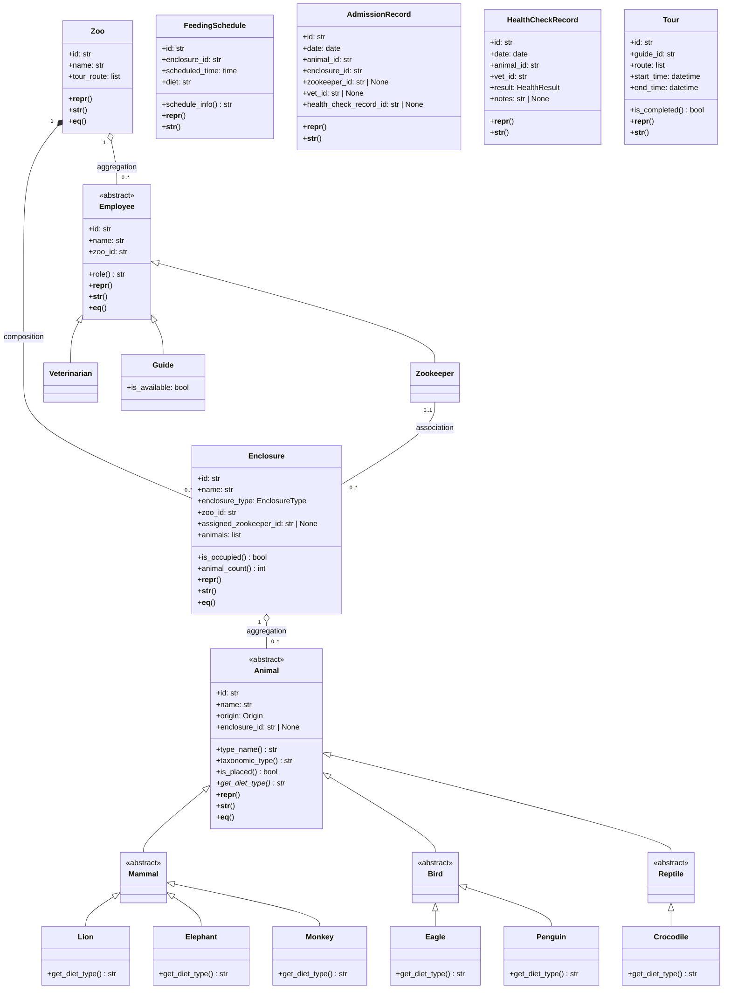

**Key OOP decisions (PRD §10 Q3 + ADR-001, ADR-003, ADR-006, ADR-020):**
- Plain classes (not `@dataclass`) — `__repr__`, `__str__`, `__eq__`, and `@property` are visibly explicit for grading.
- `get_diet_type() -> str` is the primary polymorphic method — declared abstract on `Animal`, overridden in all six leaf classes (`Lion` → `"carnivore"`, `Elephant` → `"herbivore"`, `Monkey` → `"omnivore"`, `Eagle` → `"carnivore"`, `Penguin` → `"piscivore"`, `Crocodile` → `"carnivore"`). Called polymorphically in both the feeding round and health check use cases.
- Three relationship types are present: composition (Zoo–Enclosure), aggregation (Enclosure–Animal, Zoo–Employee), association (Zookeeper–Enclosure). This satisfies the graded minimum of three OOP relationship types.
- **ADR-001:** `Enclosure` owns `animals: list[Animal]` (initialised to `[]`). `is_occupied` and `animal_count` are computed from `len(self.animals)`. No `AnimalRepository.get_by_enclosure()` is needed.
- **ADR-003:** `Guide` adds `is_available: bool = True`. `ConductGuidedTourUseCase` checks this field; raises `NoGuideAvailableError` if `False`.
- **ADR-006:** `Zoo` no longer exposes `employee_count` or `enclosure_count` properties — these had no backing data source. Sufficient `@property` instances exist across `Animal`, `Enclosure`, `Employee`, `FeedingSchedule`, and `Tour`.
- **ADR-020:** `Animal` gains `taxonomic_type: str` — a `@property` returning `type(self).__mro__[1].__name__` (the mid-tier ABC name: `"Mammal"`, `"Bird"`, or `"Reptile"`). This is distinct from `type_name` which returns the concrete class name (`"Lion"`, `"Penguin"`, …). `AdmitAnimalUseCase` compares `enclosure.enclosure_type.value == animal.taxonomic_type`. `EnclosureType` values are title-cased (`"Mammal"`, `"Bird"`, `"Reptile"`) to match. **M-1 docstring requirement:** The `taxonomic_type` property **must** carry a docstring warning: `"Assumes exactly three inheritance levels: Animal → Mammal/Bird/Reptile → concrete. Do not subclass the concrete classes — MRO index [1] will silently return the wrong tier."`

---

### C4.2 — Repository Port Contracts

All ports are `abc.ABC` interfaces in `domain/interfaces.py`. Use cases depend on ports only — never on the concrete `InMemoryRepositories` class. The single `InMemoryRepositories` class in `adapters/in_memory.py` implements all eight ports, making it the sole swap point for a future SQL adapter.

```mermaid
classDiagram
  class ZooRepository {
    <<abstract>>
    +get_by_id(id: str) Zoo
  }
  class EnclosureRepository {
    <<abstract>>
    +get_by_id(id: str) Enclosure
    +get_by_zoo(zoo_id: str) list[Enclosure]
    +save(enclosure: Enclosure) None
  }
  class AnimalRepository {
    <<abstract>>
    +get_by_id(id: str) Animal
    +save(animal: Animal) None
  }
  class EmployeeRepository {
    <<abstract>>
    +get_by_id(id: str) Employee
    +get_by_zoo_and_type(zoo_id: str, role: str) list[Employee]
    +save(employee: Employee) None
  }
  class FeedingScheduleRepository {
    <<abstract>>
    +get_by_enclosure_and_time(enclosure_id: str, t: time) FeedingSchedule | None
    +save(schedule: FeedingSchedule) None
  }
  class AdmissionRecordRepository {
    <<abstract>>
    +save(record: AdmissionRecord) None
  }
  class HealthCheckRecordRepository {
    <<abstract>>
    +save(record: HealthCheckRecord) None
  }
  class TourRepository {
    <<abstract>>
    +save(tour: Tour) None
  }

  class InMemoryRepositories {
    -_zoos: dict
    -_enclosures: dict
    -_animals: dict
    -_employees: dict
    -_schedules: dict
    -_admission_records: dict
    -_health_records: dict
    -_tours: dict
    +seed_zoo(zoo: Zoo) None
  }

  InMemoryRepositories ..|> ZooRepository
  InMemoryRepositories ..|> EnclosureRepository
  InMemoryRepositories ..|> AnimalRepository
  InMemoryRepositories ..|> EmployeeRepository
  InMemoryRepositories ..|> FeedingScheduleRepository
  InMemoryRepositories ..|> AdmissionRecordRepository
  InMemoryRepositories ..|> HealthCheckRecordRepository
  InMemoryRepositories ..|> TourRepository
```

**MVP port decisions (engineer review):**
- `ZooRepository.save()` — **removed for MVP**. No use case mutates a `Zoo` object; `get_by_id` is the only call site. The method is deferred to the future SQL adapter where Zoo creation/update will be required. **BLK-1 / ADR-025 resolution:** `seed_data(repo: InMemoryRepositories)` must still persist the `Zoo` object at startup. Because `seed_data` already accepts the concrete adapter (not a port interface), `InMemoryRepositories` exposes one additional **non-port** public method `seed_zoo(zoo: Zoo) -> None` whose sole caller is `seed_data`. This is not on any `abc.ABC` port; no use case depends on it; it does not widen the port surface. Direct `_zoos` dict manipulation inside `seed_data` (Option C) was rejected as a breach of encapsulation. Restoring `save()` to the port (Option B) was rejected because it falsely implies a use case exists that mutates Zoo. (ADR-025)
- `ZooRepository.get_by_id` — **raises `EntityNotFoundError` on miss** (same contract as all other `get_by_id` methods). Never returns `None`. (ADR-015)
- `AnimalRepository.get_unplaced()` — **removed for MVP**. All five use cases fetch animals by ID; no use case scans for unplaced animals. Removed to avoid dead port surface that would need test coverage with no caller.
- `FeedingScheduleRepository.get_by_enclosure_and_time` — **at most one schedule per `(enclosure_id, scheduled_time)` pair**. The in-memory adapter enforces this by using `(enclosure_id, scheduled_time)` as the composite dict key on `save`, so duplicate-time saves overwrite silently. The port contract assumes uniqueness; storing duplicates produces undefined behaviour. (ADR-014)
- `InMemoryRepositories` has **no `seed()` method**. Seed logic lives in `infrastructure/seed.py` as the standalone function `seed_data(repo: InMemoryRepositories)`, called once from `main.py` at startup. (ADR-017)

**Adapter swap:** To introduce PostgreSQL, implement a `SQLAlchemyRepositories` class satisfying all port contracts. No changes to `domain/` or `usecases/` are required. Only `adapters/in_memory.py` and `infrastructure/dependencies.py` are updated.

---

### C4.3 — Use Case Classes and DTOs

Each use case receives a frozen dataclass request DTO, returns a response DTO, and raises typed domain exceptions. The web layer maps those exceptions to HTTP status codes (see §C3 exception table). Use cases log with `extra={}` for operational context.

```mermaid
classDiagram
  class AssignZookeeperRequest {
    +zoo_id: str
    +enclosure_id: str
    +zookeeper_id: str
  }
  class AssignZookeeperResponse {
    +enclosure_id: str
    +zookeeper_id: str
  }
  class AssignZookeeperUseCase {
    -enclosure_repo: EnclosureRepository
    -employee_repo: EmployeeRepository
    +execute(req: AssignZookeeperRequest) AssignZookeeperResponse
  }
  AssignZookeeperUseCase --> AssignZookeeperRequest
  AssignZookeeperUseCase --> AssignZookeeperResponse

  class AdmitAnimalRequest {
    +animal_id: str
    +zoo_id: str
    +vet_id: str | None
    +health_check_result: HealthResult | None
    +health_check_notes: str | None
  }
  class AdmitAnimalResponse {
    +animal_id: str
    +enclosure_id: str
    +admission_record_id: str
  }
  class AdmitAnimalUseCase {
    -animal_repo: AnimalRepository
    -enclosure_repo: EnclosureRepository
    -employee_repo: EmployeeRepository
    -admission_repo: AdmissionRecordRepository
    -health_repo: HealthCheckRecordRepository
    +execute(req: AdmitAnimalRequest) AdmitAnimalResponse
  }
  AdmitAnimalUseCase --> AdmitAnimalRequest
  AdmitAnimalUseCase --> AdmitAnimalResponse

  class FeedingRoundRequest {
    +enclosure_id: str
    +zookeeper_id: str
    +current_time: time
  }
  class FeedingRoundResponse {
    +enclosure_id: str
    +fed_count: int
    +note: str
  }
  class ExecuteFeedingRoundUseCase {
    -enclosure_repo: EnclosureRepository
    -employee_repo: EmployeeRepository
    -schedule_repo: FeedingScheduleRepository
    +execute(req: FeedingRoundRequest) FeedingRoundResponse
  }
  ExecuteFeedingRoundUseCase --> FeedingRoundRequest
  ExecuteFeedingRoundUseCase --> FeedingRoundResponse

  class HealthCheckRequest {
    +animal_id: str
    +vet_id: str
    +result: HealthResult
    +notes: str | None
  }
  class HealthCheckResponse {
    +health_check_record_id: str
    +result: HealthResult
  }
  class ConductHealthCheckUseCase {
    -animal_repo: AnimalRepository
    -employee_repo: EmployeeRepository
    -health_repo: HealthCheckRecordRepository
    +execute(req: HealthCheckRequest) HealthCheckResponse
  }
  ConductHealthCheckUseCase --> HealthCheckRequest
  ConductHealthCheckUseCase --> HealthCheckResponse

  class GuidedTourRequest {
    +guide_id: str
    +zoo_id: str
  }
  class GuidedTourResponse {
    +tour_id: str
    +route: list
    +start_time: datetime
    +end_time: datetime
  }
  class ConductGuidedTourUseCase {
    -zoo_repo: ZooRepository
    -enclosure_repo: EnclosureRepository
    -employee_repo: EmployeeRepository
    -tour_repo: TourRepository
    +execute(req: GuidedTourRequest) GuidedTourResponse
  }
  ConductGuidedTourUseCase --> GuidedTourRequest
  ConductGuidedTourUseCase --> GuidedTourResponse
```

**Domain exceptions per use case:**

| Use case | Exceptions raised |
|----------|------------------|
| `AssignZookeeperUseCase` | `EntityNotFoundError`, `InvalidEmployeeRoleError`, `EnclosureNotInZooError` |
| `AdmitAnimalUseCase` | `EntityNotFoundError`, `InvalidEmployeeRoleError`, `InvalidRequestError`, `AnimalAlreadyPlacedError`, `HealthCheckNotClearedError`, `NoSuitableEnclosureError` |
| `ExecuteFeedingRoundUseCase` | `EntityNotFoundError`, `InvalidEmployeeRoleError`, `FeedingNotDueError`, `ZookeeperNotAssignedError` |
| `ConductHealthCheckUseCase` | `EntityNotFoundError`, `InvalidEmployeeRoleError` |
| `ConductGuidedTourUseCase` | `EntityNotFoundError`, `InvalidEmployeeRoleError`, `NoGuideAvailableError`, `GuideNotInZooError` |

**`FeedingRoundResponse.note` — defined values (DQ-A):** `note: str` is always present (never `None` or absent). Two defined values:
- **Empty enclosure:** `"no animals to feed"` — `fed_count` is `0`.
- **Success (animals fed):** `"Fed {fed_count} animals (diets: {', '.join(diet_types)})"` — e.g. `"Fed 2 animals (diets: carnivore, piscivore)"`. `diet_types` is built by calling `animal.get_diet_type()` polymorphically on each animal in the enclosure (the grading-signal polymorphic dispatch). The result is **included** in the response note, not discarded. Order matches enclosure `animals` list order.

**`FeedingRoundRequest.current_time` — intentional explicit-clock pattern (ADR-019):** `current_time: time` is supplied by the client in the request body. The use case **must not** call `datetime.now()` internally; it must use `req.current_time` directly. This is a deliberate testability decision: the feeding schedule comparison is an exact match (`current_time == schedule.scheduled_time`), so caller-supplied time makes BDD scenarios deterministic at any wall-clock time. This is not a security concern at MVP scope. **M-5:** The Pydantic router schema for `FeedingRoundRequest` must include `json_schema_extra={"example": {"enclosure_id": "enc-mammal-1", "zookeeper_id": "emp-zk-1", "current_time": "09:00:00"}}` to document the canonical `"HH:MM:SS"` wire format (ADR-023).

**`AssignZookeeperRequest.zoo_id` — intentional three-way check (ADR-016):** Although the enclosure already carries `zoo_id` internally, requiring `zoo_id` in the request body is intentional. The use case performs a three-way equality check: `enclosure.zoo_id == request.zoo_id == zookeeper.zoo_id`. This makes the zoo-boundary invariant explicit at the API surface and catches misconfigured callers early. `EnclosureNotInZooError` when `request.zoo_id` mismatches is a correct validation response, not a spurious error.

**ADR-002 note — `AdmitAnimalRequest` health check fields:**

- `vet_id`, `health_check_result`, and `health_check_notes` are **required** (non-`None`) only when `animal.origin == EXTERNAL`. The use case raises `InvalidRequestError` if any of these is `None` for an external animal.
- For `origin == INTERNAL`, any non-`None` values in `vet_id`, `health_check_result`, and `health_check_notes` are **silently ignored** — no health-check record is created and no error is raised. Pydantic keeps all three fields `str|None` / `HealthResult|None` so no router-level validation error occurs.
- `HealthCheckNotClearedError` is raised when `health_check_result != HealthResult.HEALTHY` for an external animal.
- `InvalidEmployeeRoleError` is raised in the `EXTERNAL` branch if the employee fetched by `vet_id` is not an instance of `Veterinarian`.

**DQ-C — `AdmissionRecord.health_check_record_id: str | None`:** `AdmissionRecord` gains `health_check_record_id: str | None`. When the animal's origin is `EXTERNAL`, `AdmitAnimalUseCase` sets this field to the `id` of the freshly created `HealthCheckRecord` before saving the `AdmissionRecord`. When origin is `INTERNAL` (no health check performed), `health_check_record_id` is `None`. This structurally links the two records from the same admission event and prevents a future auditor from needing a join on `(animal_id, vet_id, date)` to reconstruct the relationship.

**Employee role validation (engineer finding #3):** Every use case that receives an employee ID asserts the correct subtype via `isinstance` immediately after the `EmployeeRepository.get_by_id` call. On failure the use case raises `InvalidEmployeeRoleError("Expected <SubType>, got <actual role>")`. The check is **not** delegated to the repository — `get_by_id` returns the broadest type (`Employee`) and the use case is responsible for narrowing it. This preserves the port's single-responsibility contract and keeps domain logic in the use case layer.

---

### C4.4 — Process Sequence Diagrams

One sequence diagram per business process. All flows follow the same participant chain: `Client → Router → UseCase → Repo(s) → Domain entities`. Flows are derived from `docs/business-processes-detailed.md`.

---

#### Process 1 — Assign Zookeeper to Enclosure

```mermaid
sequenceDiagram
  participant C as Client
  participant R as Router
  participant UC as AssignZookeeperUseCase
  participant ER as EnclosureRepo
  participant EmpR as EmployeeRepo

  C->>R: POST /enclosures/{id}/zookeeper
  Note right of C: body: {zookeeper_id, zoo_id}
  R->>UC: execute(AssignZookeeperRequest)
  UC->>ER: get_by_id(enclosure_id)
  ER-->>UC: Enclosure
  UC->>EmpR: get_by_id(zookeeper_id)
  EmpR-->>UC: Employee
  UC->>UC: assert isinstance(employee, Zookeeper)
  Note over UC: raises InvalidEmployeeRoleError if not a Zookeeper
  UC->>UC: validate three-way zoo_id equality
  Note over UC: enclosure.zoo_id == request.zoo_id == zookeeper.zoo_id
  Note over UC: raises EnclosureNotInZooError if mismatch (ADR-016)
  UC->>UC: enclosure.assigned_zookeeper_id = zookeeper.id
  Note over UC: ADR-031 - idempotent if same zookeeper already assigned; overwrites with same value, returns 200 OK
  UC->>ER: save(enclosure)
  ER-->>UC: None
  UC-->>R: AssignZookeeperResponse
  R-->>C: 200 OK {enclosure_id, zookeeper_id}
```

---

#### Process 2 — Animal Admission to Enclosure

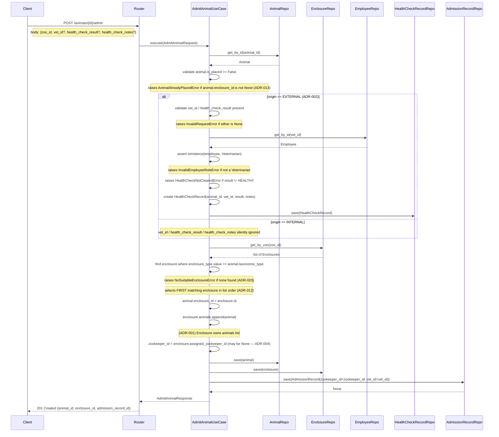

---

#### Process 3 — Execute Feeding Round

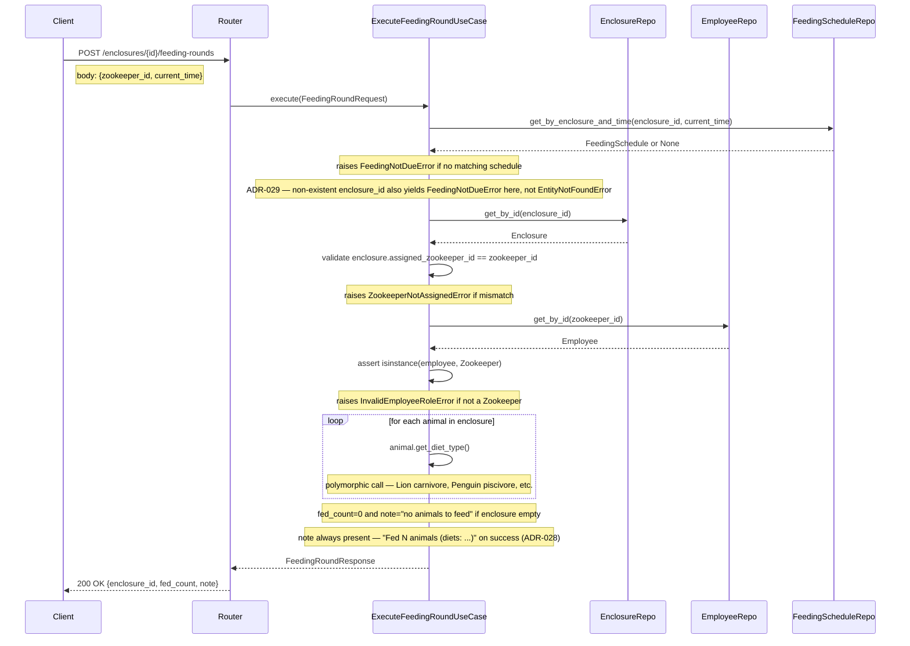

---

#### Process 4 — Conduct Health Check

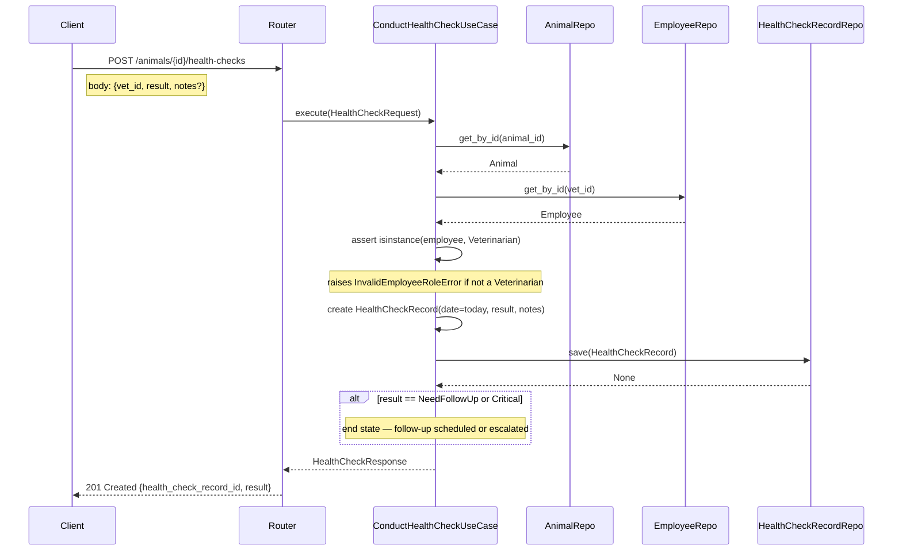

---

#### Process 5 — Conduct Guided Tour

```mermaid
sequenceDiagram
  participant C as Client
  participant R as Router
  participant UC as ConductGuidedTourUseCase
  participant EmpR as EmployeeRepo
  participant ZR as ZooRepo
  participant EncR as EnclosureRepo
  participant TR as TourRepo

  C->>R: POST /tours
  Note right of C: body: {guide_id, zoo_id}
  R->>UC: execute(GuidedTourRequest)
  UC->>EmpR: get_by_id(guide_id)
  EmpR-->>UC: Employee
  UC->>UC: assert isinstance(employee, Guide)
  Note over UC: raises InvalidEmployeeRoleError if not a Guide
  UC->>UC: validate guide.zoo_id == request.zoo_id
  Note over UC: raises GuideNotInZooError if mismatch (DQ-B; cross-zoo consistency guard)
  UC->>UC: validate guide.is_available == True
  Note over UC: raises NoGuideAvailableError if guide.is_available is False
  UC->>ZR: get_by_id(zoo_id)
  ZR-->>UC: Zoo
  UC->>UC: route = zoo.tour_route
  loop for each enclosure_id in route
    UC->>EncR: get_by_id(enclosure_id)
    EncR-->>UC: Enclosure
    Note over UC: raises EntityNotFoundError if enclosure not in store
    UC->>UC: visit enclosure in order
  end
  UC->>UC: create Tour(guide_id, route, start_time=now, end_time=now)
  Note over UC: start_time == end_time == now() - intentional (ADR-011)
  Note over UC: synchronous MVP: tour begins and ends in one request
  Note over UC: is_completed always True - no 'tour in progress' state exists
  UC->>UC: guide.is_available = False
  UC->>EmpR: save(guide)
  EmpR-->>UC: None
  UC->>TR: save(tour)
  TR-->>UC: None
  UC-->>R: GuidedTourResponse
  R-->>C: 201 Created {tour_id, route, start_time, end_time}
  Note over UC: end_time == start_time == now() - synchronous MVP (ADR-011, ADR-030)
```

---

### C4.5 — Testing Architecture

Two mandatory test layers (unit + integration) and one BDD layer, derived from `fastapi-clean-architecture` skill. The same `InMemoryRepositories` fakes are reused across all three layers.

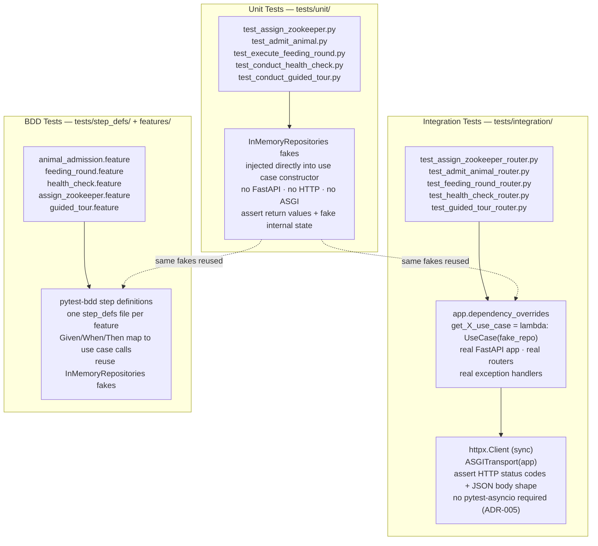

**Test isolation principles:**

| Layer | What is real | What is faked | Assert |
|-------|-------------|---------------|--------|
| Unit (`tests/unit/`) | Use case class + domain entities | `InMemoryRepositories` injected via constructor | Return DTO values; fake internal dict state |
| Integration (`tests/integration/`) | FastAPI app + routers + exception handlers | DI override (`dependency_overrides`) | HTTP status codes; JSON response body |
| BDD (`tests/step_defs/`) | Use case class + domain entities | `InMemoryRepositories` (same fakes) | Business outcome described in Gherkin |

**Test isolation rules — mandatory (ADR-003, engineer finding C-2):**

- **Unit tests:** Construct a fresh `InMemoryRepositories` instance in each test function. Never share a single instance across test functions.
- **Integration tests:** Use `app.dependency_overrides` to inject a fresh `InMemoryRepositories` per test function. Clear overrides in a `finally` block / teardown to prevent leak between tests. Do not assume seed data is in its initial state after another test has mutated it.
- **BDD tests:** The "no guide available" scenario must construct `Guide(is_available=False)` directly in its `Given` step using a fresh `InMemoryRepositories`. It must **not** reuse the shared seed guide `emp-guide-1` (which may have been toggled to `False` by a prior happy-path scenario). Seed data is a starting point only; BDD step definitions must own any state required by the scenario.
- There is no `PATCH /guides/{id}` endpoint and no server-side reset of `is_available`. The only reset is a process restart.

**ADR-005:** All integration tests use `httpx.Client` (sync) with `ASGITransport(app)`. All test functions are plain `def test_...` (not `async def`). `pytest-asyncio` is **not** a project dependency.
---

### C4.6 — Entity-Relationship Diagram

Data relationships between all persistent entities (reproduced from PRD §8.6):

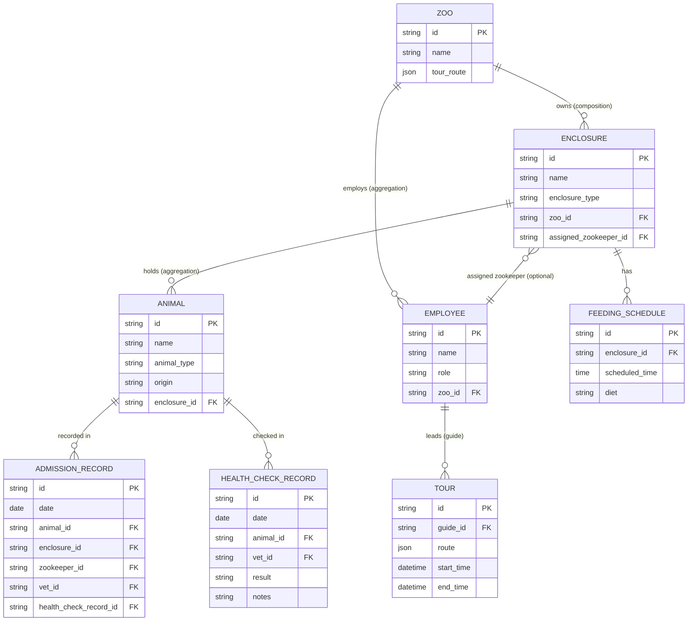

**ER notes (ADR-018):** `ANIMAL.species` is **not** a stored field — it was removed. `animal_type` is the discriminator column that a future SQL adapter must persist (e.g. SQLAlchemy `polymorphic_on`) to reconstruct the correct concrete subclass (`Lion`, `Penguin`, etc.) on load. `type_name` on the domain entity is a `@property` returning `type(self).__name__`; it is not stored independently.

---

## ADR Summary

Binding architectural decisions from PRD §10 (both skills applied):

| Decision | Choice | Rationale |
|----------|--------|-----------|
| Architecture pattern | Hexagonal / Clean Architecture | Domain and use cases are framework-agnostic; DB adapter swap requires only replacing `adapters/in_memory.py` |
| Persistence | In-memory dict repositories as production adapter | No DB/Docker setup risk for MVP; `domain/interfaces.py` port boundary stays unchanged for future SQL swap |
| Sync (no `async/await`) | Plain `def` throughout | No I/O means async adds zero value; reduces cognitive overhead for graders |
| Domain entities | Plain classes, not `@dataclass` | `__repr__`, `__str__`, `__eq__`, and `@property` are visibly explicit; `@dataclass` would auto-generate or hide them |
| Polymorphism | `get_diet_type()` abstract on `Animal`, overridden in 6 leaf classes | Called polymorphically in feeding round and health check use cases |
| Logging | Standard `logging` module + `JSONFormatter` | Structured JSON; use cases log with `extra={}` for operational context (`animal_id`, `enclosure_id`, etc.) |
| Config | Plain `config.py` dataclass, no Pydantic Settings | No external env vars; grader runs `uvicorn main:app` with zero setup |
| Exception handling | Global `register_exception_handlers(app)` in `adapters/web/exception_handlers.py` | Single registration point; consistent `{"detail": "..."}` JSON shape; domain stays unaware of HTTP |
| Testing | Unit (constructor injection of fakes) + Integration (ASGI + `dependency_overrides`) + BDD (pytest-bdd) | All three layers are graded; fakes are defined once and reused across all layers |
| **ADR-001** — Enclosure owns `animals` list | `Enclosure.__init__` gains `animals: list = []`; `is_occupied` and `animal_count` backed by it | `business-processes-detailed.md`: "Enclosure holds list of animals"; no new repo method needed |
| **ADR-002** — Admission carries health-check result | `AdmitAnimalRequest` gains `health_check_result: HealthResult|None`, `health_check_notes: str|None`; `vet_id: str|None` | Inline health check avoids use-case calling use-case; no new `HealthCheckRecordRepository.get_by_animal` |
| **ADR-003** — `Guide.is_available` managed by use case | `Guide.__init__` gains `is_available: bool = True`; `ConductGuidedTourUseCase` raises `NoGuideAvailableError` if `False` on entry, then sets `guide.is_available = False` and calls `employee_repo.save(guide)` after building the tour; no reset endpoint exists; BDD/integration tests must inject fresh `InMemoryRepositories` per test function | Flag is dynamic — toggled per tour, not write-once; seed data sets `is_available=True` so graders can call `POST /tours` immediately |
| **ADR-004** — `AdmissionRecord.zookeeper_id` nullable | `str|None`; sourced from `enclosure.assigned_zookeeper_id` after enclosure selection | Enclosure may have no zookeeper at admission time; nullability makes the model honest |
| **ADR-005** — Sync integration test client | `httpx.Client` (sync) + `ASGITransport`; no `pytest-asyncio` | Consistent with "sync throughout" (PRD §7.3) |
| **ADR-006** — No `employee_count`/`enclosure_count` on `Zoo` | Properties removed; counts via repository queries | `Zoo` stores no collections; dual-state avoided; `@property` requirement met across other entities |
| **ADR-007** — No `FeedingRecord` for MVP | Feeding round result is response-only; not persisted | PRD §9.4 names only AdmissionRecord, HealthCheckRecord, Tour as required audit entities |
| **ADR-008** — `AssignZookeeperUseCase` skips zoo existence check | Cross-field equality check sufficient | No functional benefit in-memory; future SQL adapter enforces FK integrity |
| **ADR-009** — Seed data via `infrastructure/seed.py` | `seed_data(repo)` called in `main.py` at startup; stable IDs documented in C3 | Graders need pre-seeded IDs to call any endpoint; full rationale in `adr.md` ADR-009 |
| **ADR-010** — Employee role validated via `isinstance` in each use case | Each use case asserts correct subtype immediately after `get_by_id`; raises `InvalidEmployeeRoleError` on mismatch | Repository returns broadest type (`Employee`); narrowing is use-case responsibility; keeps port SRP; full rationale in `adr.md` ADR-010 |
| **ADR-011** — `Tour` synchronous creation: `start_time == end_time == now()` | Both timestamps set to `datetime.now()` at construction time; `is_completed` always `True` for MVP; no "tour in progress" state, no `TourStatus` enum, no `PATCH /tours/{id}` | Entire tour is synchronous within one HTTP request; `is_completed` property retained for semantic clarity and future async extension |
| **ADR-012** — Enclosure selection: first match in list order | `AdmitAnimalUseCase` selects `matching[0]` from `enclosure_repo.get_by_zoo(zoo_id)` filtered by `enclosure_type.value == animal.taxonomic_type` | Deterministic; in-memory dict preserves insertion/seed order; BDD tests rely on known seed order |
| **ADR-013** — `AnimalAlreadyPlacedError` guards re-admission | `AdmitAnimalUseCase` checks `animal.is_placed` immediately after fetch; raises `AnimalAlreadyPlacedError → 422` if `True`; move semantics deferred | Re-admission would duplicate animal in enclosure list; guard prevents silent data corruption |
| **ADR-014** — `FeedingSchedule` uniqueness: one per `(enclosure_id, scheduled_time)` | Port contract states uniqueness assumption; in-memory adapter upserts by composite key `(enclosure_id, scheduled_time)` on `save` | `get_by_enclosure_and_time` returns `FeedingSchedule \| None`; duplicates would produce undefined behaviour |
| **ADR-015** — `ZooRepository.get_by_id` raises `EntityNotFoundError` on miss | Port contract explicitly states raise-on-miss; no `None` return | Consistent with all other `get_by_id` methods; mapping `EntityNotFoundError → 404` already registered |
| **ADR-016** — `zoo_id` in `AssignZookeeperRequest` is intentional | Three-way equality check `enclosure.zoo_id == request.zoo_id == zookeeper.zoo_id`; `EnclosureNotInZooError → 422` on mismatch | Makes zoo-boundary invariant explicit at API surface; catches misconfigured callers early |
| **ADR-017** — `seed_data(repo)` standalone function; no `InMemoryRepositories.seed()` | `infrastructure/seed.py` owns all seed logic; `main.py` calls `seed_data(repo)` at startup; `InMemoryRepositories` has no seed method | Single Responsibility: repo is pure data-access; C4.2 diagram updated to remove `seed()` |
| **ADR-018** — `ANIMAL.species` removed from ER diagram | `animal_type` is the discriminator; `type_name` is a `@property` not stored; `species` column removed from C4.6 | ER is for future SQL adapter guidance; spurious `species` column removed to prevent implementer confusion |
| **ADR-019** — `current_time` in `FeedingRoundRequest` supplied by client intentionally | Use case must use `req.current_time`; must not call `datetime.now()` internally | Exact-match schedule rule requires deterministic time for BDD testing; not a security concern at MVP scope |
| **ADR-020** — `Animal.taxonomic_type` resolves EnclosureType matching (CRIT-1) | New `@property taxonomic_type` returns `type(self).__mro__[1].__name__` (`"Mammal"`, `"Bird"`, `"Reptile"`); `EnclosureType` values title-cased to match; comparison is `enclosure_type.value == animal.taxonomic_type` | `type_name` returned concrete class name (`"Lion"`) — comparing against `"Mammal"` always fails; `taxonomic_type` resolves the type mismatch at the correct abstraction level |
| **ADR-021** — Minimal GET endpoints for grader state verification | `GET /animals/{id}` and `GET /enclosures/{id}` added; direct repo reads, no use case; Pydantic response schemas `AnimalResponse`, `EnclosureResponse` | Without reads, grader cannot verify admission placement or zookeeper assignment outcomes |
| **ADR-022** — Second seed guide `emp-guide-2` prevents one-shot tour exhaustion | `Guide(id="emp-guide-2", name="Dave", zoo_id="zoo-1", is_available=True)` added to `seed_data()` | `guide.is_available` is one-way per server session; single guide allows only one `POST /tours` call before `NoGuideAvailableError` |
| **ADR-023** — `current_time` wire format: `"HH:MM:SS"` (ISO 8601) | Canonical format is `"HH:MM:SS"` (e.g. `"09:00:00"`); Pydantic v2 on Python 3.12 also accepts `"HH:MM"` but this is not canonical; BDD scenarios use full `"HH:MM:SS"` | Exact-match comparison requires consistent format between client input and stored `time(9,0,0)` |
| **ADR-024** — Process 3 check ordering intentional: schedule before zookeeper existence | Schedule check first → enclosure fetch → assignment check → employee fetch → isinstance; non-existent but non-matching `zookeeper_id` yields `ZookeeperNotAssignedError`, not `EntityNotFoundError` | Fail-fast on most common rejection; domain semantics: authorisation failure is the primary error regardless of existence |
| **ADR-025** — `seed_data()` Zoo persistence via non-port `seed_zoo()` method (BLK-1) | `InMemoryRepositories` exposes one additional public method `seed_zoo(zoo: Zoo) -> None` whose sole caller is `seed_data(repo: InMemoryRepositories)` in `infrastructure/seed.py`; this method is **not** declared on any `abc.ABC` port; no use case depends on it | `ZooRepository.save()` was removed from the port (no use case mutates Zoo); direct `_zoos` dict access in `seed_data` (Option C) breaches encapsulation; restoring `save()` to the port (Option B) falsely implies a use-case write path exists; Option A (non-port seeding method) is the honest, minimal solution |
| **ADR-026** — `ConductGuidedTourUseCase` validates `guide.zoo_id == request.zoo_id` (DQ-B) | After `isinstance(employee, Guide)` check, use case validates `guide.zoo_id == request.zoo_id`; raises `GuideNotInZooError → 422` on mismatch; `GuideNotInZooError` added to domain exceptions and exception handler | Single-zoo MVP assumption makes this check benign in practice, but omitting it creates an inconsistency with `AssignZookeeperUseCase`'s three-way zoo check (ADR-016); architectural consistency wins over MVP pragmatism for a graded project |
| **ADR-027** — `AdmissionRecord.health_check_record_id: str \| None` (DQ-C) | `AdmissionRecord` gains `health_check_record_id: str \| None`; set to the `HealthCheckRecord.id` for external animals; `None` for internal animals | Structurally links the two records created in the same admission event; prevents auditor join on `(animal_id, vet_id, date)`; zero implementation cost; `str \| None` matches the nullable `vet_id` pattern already on the same entity |
| **ADR-028** — `FeedingRoundResponse.note` always-present string (DQ-A) | `note: str` (never `None`); success value: `"Fed {n} animals (diets: {', '.join(diet_types)})"` built from `get_diet_type()` polymorphic calls; empty-enclosure value: `"no animals to feed"` | `get_diet_type()` result is included in the response — it is not discarded — making the polymorphic dispatch visible in the API output and demonstrating the OOP requirement; `str` (not `str \| None`) because a note is always semantically meaningful |
| **ADR-029** — Process 3 non-existent `enclosure_id` yields `FeedingNotDueError`, not `EntityNotFoundError` | Accepted as-is; non-existent `enclosure_id` causes schedule lookup to return `None` → `FeedingNotDueError` (422) before `enclosure_repo.get_by_id` can raise `EntityNotFoundError` (404) | Fail-fast ordering (ADR-024 rationale applies); analogous to documented zookeeper-id ordering; BDD/integration tests must assert 422 for invalid `enclosure_id` on feeding round endpoint |
| **ADR-030** — `GuidedTourResponse.end_time: datetime` added | `GuidedTourResponse` gains `end_time: datetime`; value equals `start_time` (both `datetime.now()` at creation per ADR-011); C4.3 DTO and C4.4 Process 5 response line updated | No `GET /tours/{id}` endpoint exists; omitting `end_time` leaves graders unable to verify tour completion time; free information that improves verifiability |
| **ADR-031** — `AssignZookeeperUseCase` idempotent same-zookeeper re-assignment | Re-assigning the same zookeeper to an enclosure they already own returns 200 OK; overwrite is a no-op state-wise; no new exception raised; implementers must not add an already-assigned guard | HTTP idempotency semantics; no business rule forbids re-assigning the same person; adding an error for a non-error case would be unexpected; safe for in-memory storage |
